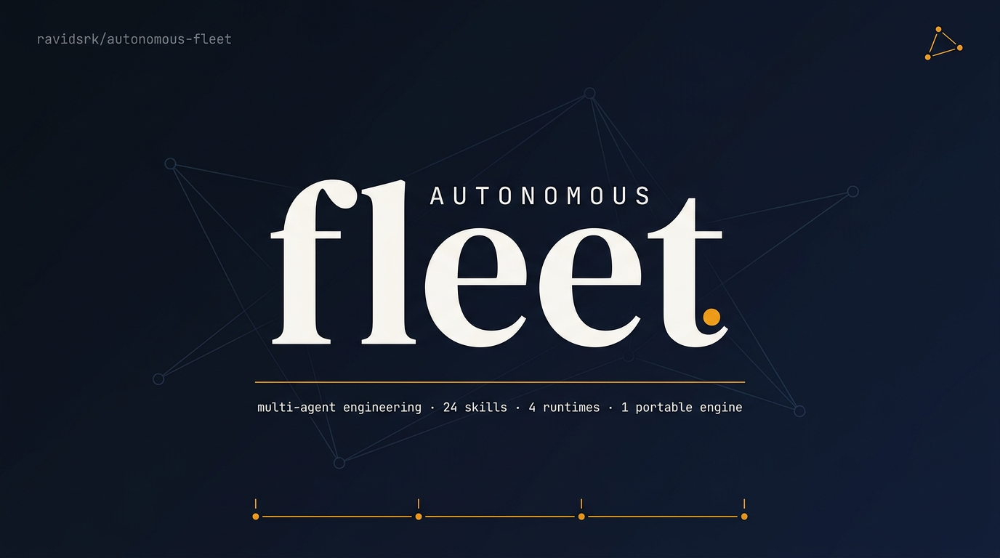
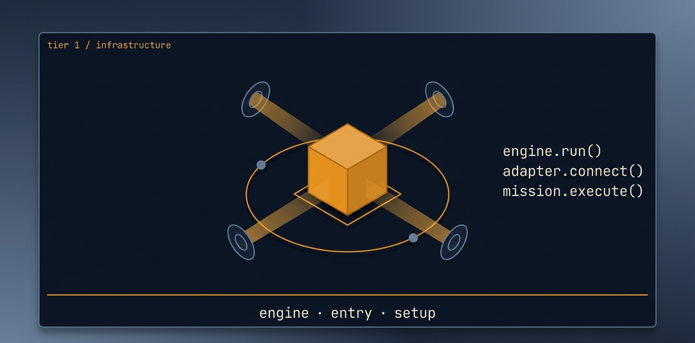
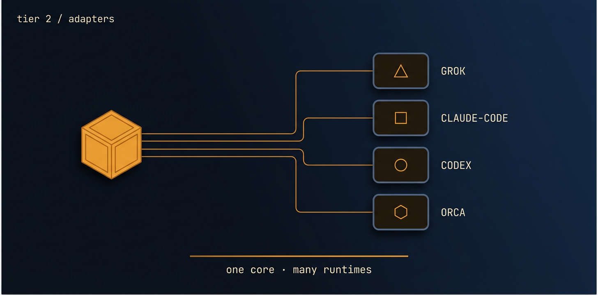
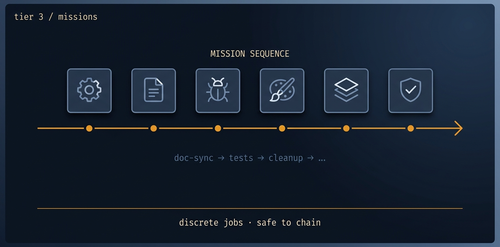

<h1 align="center">autonomous-fleet</h1>

<p align="center">
  <strong>You describe the work. A team of AI agents ships the PRs.</strong><br/>
  Drop-in skills for Claude Code, Grok, Codex, and Orca.
</p>

<p align="center">
  <a href="LICENSE"></a>
  <a href="https://agentskills.io/"></a>
  <a href="https://github.com/ravidsrk/autonomous-fleet/stargazers"></a>
  <a href="https://github.com/ravidsrk/autonomous-fleet/commits/main"></a>
</p>

<p align="center">
  
</p>

<p align="center"><sub>↑ Generated by Nano Banana Pro via OpenRouter. Prompt: <a href="scripts/banner/banner-prompt.txt">scripts/banner/banner-prompt.txt</a></sub></p>

---

# What it is

A library of skills you install into your coding agent (Claude Code, Grok, Codex, or [Orca](https://github.com/diggerhq/orca)). Once installed, you describe a chunk of work in plain English. In the background, a small team of worker agents (usually 2–5) split it up, work in parallel on their own git branches, and open one pull request per piece — with the same disciplines a senior engineer would apply: small commits, conflict-aware merges, a frozen scope per run, and verification that the change actually works end-to-end before it's marked done.

**You stay the reviewer. They do the typing.**

---

# What you can ask it to do

Say this in your coding agent's chat, after installation:

| You say | What it ships |
|---|---|
| *"The docs are out of date, fix them"* | One PR per stale doc file. A summary doc listing what was out of sync. |
| *"Raise test coverage on the payments module"* | One PR per file being tested (typically 3–8 PRs). Coverage report in each PR description. |
| *"Reproduce and fix these 12 bugs"* | One reproducer per bug → one fix PR per area of the code. Bugs that can't be reproduced get flagged, not faked. |
| *"Red-team this API and patch what you find"* | A review report opened as a GitHub issue, then one PR per finding it patches. |
| *"Get this ready to ship"* | A multi-step campaign: review the surface → close findings → raise test coverage → sync the docs → check end-to-end works. Stops if any step fails. |

Each run takes minutes to hours depending on scope. You get GitHub notifications when PRs are ready to review.

---

# Try it

> Install takes about a minute. The first PR usually shows up in a few minutes.

### Step 1 — Install the skills into your repo

**In a terminal,** in your project's root directory:

```bash
npx skills add https://github.com/ravidsrk/autonomous-fleet \
  --skill setup-autonomous-fleet \
  --skill autonomous-fleet \
  --skill autonomous-fleet-core \
  --skill autonomous-fleet-adapter-claude-code \
  --skill doc-sync \
  -y
```

This creates a `.agents/skills/` folder (gitignored — your `git status` stays clean). The folder is the universal [`agentskills.io`](https://agentskills.io/) format, which Claude Code, Grok, Codex, and Orca all read.

> Using a different agent? Replace `autonomous-fleet-adapter-claude-code` with `-grok`, `-codex`, or `-orca`. Want every skill? Use `--skill '*'`.

### Step 2 — Configure the repo once

**In your coding agent's chat** (Claude Code's chat panel, Codex's chat, etc.), invoke the skill:

```
/setup-autonomous-fleet
```

> In Claude Code and Codex, `/setup-autonomous-fleet` is a slash command. In Grok and Orca, paste the skill's name as a natural-language instruction (the runtimes that don't have slash UIs route by skill name). Either way, the skill picks up your repo's config.

It asks which agent you're on, which branch prefix to use, and writes the config to your repo.

### Step 3 — Ask it to do work

**In the same chat,** plain English:

```
The docs are out of date, fix them
```

What you'll see, in order:
1. A plan written to a file you can read and abort if you don't like it.
2. Worker agents kicked off (you'll see them spawn).
3. PRs appear in GitHub as each one finishes — usually within a few minutes.

Each PR has a readiness doc explaining what was done, why, and how it was verified. **You review and merge.**

To stop a run mid-flight, close the chat (workers check in with the ledger and exit). The file ledger survives, so you can pick up where you left off in a new chat.

That's it. The rest of this README is for going deeper.

---

# The full menu

> 21 skills total. Install the ones you need with `--skill <name>`, or grab everything with `--skill '*'`.

### Daily housekeeping

| Skill | Ask it to… |
|---|---|
| [`doc-sync`](skills/doc-sync/) | Sync README, CI files, and build scripts to match the code |
| [`test-coverage`](skills/test-coverage/) | Raise coverage on a specific module or file |
| [`dependency-update`](skills/dependency-update/) | Bump deps, one PR per package, with per-package rollback |
| [`cleanup`](skills/cleanup/) | Remove dead code, unused imports, lint debt — one sweep per axis |

> 💡 Why start with `doc-sync`? It has the **highest merge-success rate** of any AI-agent PR category in the AIDev dataset (~33k PRs across major repos). [arXiv:2601.15195](https://arxiv.org/abs/2601.15195), Ehsani et al., MSR 2026.

### Multi-step jobs

| Skill | Ask it to… |
|---|---|
| [`bug-batch`](skills/bug-batch/) | Reproduce a list of bugs first, then fix them batched by surface |
| [`adversarial-review-and-fix`](skills/adversarial-review-and-fix/) | Red-team a surface, write a review, then patch the findings |
| [`targeted-migration`](skills/targeted-migration/) | Run a scoped migration (library swap, syntax shift, framework bump) |
| [`design-integration`](skills/design-integration/) | Integrate a design system into the existing UI |
| [`landing-page-convergence`](skills/landing-page-convergence/) | Converge a landing page on a target spec or metric |
| [`inference-cost`](skills/inference-cost/) | Reduce LLM cost with measurement-first, sanctioned levers only |

### Ship a product

| Skill | Ask it to… |
|---|---|
| [`legacy-rebuild`](skills/legacy-rebuild/) | Gradually rebuild a legacy module behind a feature seam |
| [`take-product-to-completion`](skills/take-product-to-completion/) | Multi-week ship to launch — only finishes when end-to-end works |

### Run a campaign (chain skills together)

```bash
./scripts/run-campaign.sh claude-code --preset repo-health      # doc-sync → test-coverage → cleanup
./scripts/run-campaign.sh claude-code --preset ship-with-proof  # review-fix → test-coverage → doc-sync
./scripts/run-campaign.sh claude-code --preset quality-gate     # review-fix → test-coverage
./scripts/run-campaign.sh claude-code --preset align-then-ship  # take-product-to-completion (gated)
```

Each step waits for the previous one to pass a verification gate. If a gate fails, the campaign stops and tells you why. Add `--dry-run` to see the plan without running it.

<details>
<summary>Plumbing skills you don't call directly</summary>

These get pulled in automatically by the skills above:

| Skill | Role |
|---|---|
| [`autonomous-fleet`](skills/autonomous-fleet/) | The entry point — routes vague requests to the right mission |
| [`autonomous-fleet-core`](skills/autonomous-fleet-core/) | The engine — every run goes through it |
| [`fleet-program`](skills/fleet-program/) | The campaign runner — chains missions with conditional gates |
| [`setup-autonomous-fleet`](skills/setup-autonomous-fleet/) | First-run repo configuration |

And one adapter per supported runtime:

| Skill | Runtime |
|---|---|
| [`adapter-claude-code`](skills/autonomous-fleet-adapter-claude-code/) | Claude Code |
| [`adapter-grok`](skills/autonomous-fleet-adapter-grok/) | Grok Build |
| [`adapter-codex`](skills/autonomous-fleet-adapter-codex/) | OpenAI Codex |
| [`adapter-orca`](skills/autonomous-fleet-adapter-orca/) | Orca |
| [`adapter-template`](skills/autonomous-fleet-adapter-template/) | Template — copy this to add a new runtime |

</details>

---

# What every run guarantees

These are the disciplines baked into the engine, so you don't have to remember to ask for them:

### 🔒 The work won't go sideways

- One PR per unit — never one giant blob
- Original commits preserved, never squashed
- Merges are conflict-aware; worktrees cleaned up after every merge
- Testnet / staging only — merge ≠ deploy
- The file ledger survives session restarts and context compaction

### 🧪 The work is verified, not just attempted

- External facts get verified against real sources (logged to `docs/research-notes.md`)
- A run can't complete with `unverified_assumptions > 0`
- Every run reports `cost_estimate` (model + USD) in its outcome
- Shell commands go through a sandboxed wrapper that scrubs env vars
- Optional `container-use` placement gives each worker an isolated VM

### 🎯 "Done" means actually done

- A green test suite is **not** "done"
- Shipping missions only complete when end-to-end is verified (not just exit codes)
- Every run has a frozen scope boundary — no surprise expansions
- Editorial / credential decisions route through explicit lanes (fix / draft-and-gate / refuse) — never fabricated

---

<details>
<summary><b>Under the hood — the architecture</b></summary>

The framework has four layers. You only interact with the top layer; the rest happens automatically.

```
┌──────────────────────────────────────────────────────────────┐
│  autonomous-fleet (umbrella)         ← routes vague requests │
│  fleet-program (campaigns)           ← chains + conditional  │
│  setup-autonomous-fleet              ← per-repo config       │
├──────────────────────────────────────────────────────────────┤
│  autonomous-fleet-core               ← engine (THE method)   │
├──────────────────────────────────────────────────────────────┤
│  adapter-{claude-code, grok, codex, orca, template}          │
│  ↑ maps the engine to one runtime's real commands            │
├──────────────────────────────────────────────────────────────┤
│  missions × 12                                               │
│  Tier 1 (recurring) → Tier 2 (campaign) → Tier 3 (ship)      │
└──────────────────────────────────────────────────────────────┘
```

- **Core + mission + adapter** = a single-mission run
- **Core + fleet-program + adapter** = a campaign (linear or conditional, one mission at a time per repo)

<table>
  <tr>
    <td width="33%" align="center"></td>
    <td width="33%" align="center"></td>
    <td width="33%" align="center"></td>
  </tr>
  <tr>
    <td align="center"><strong>🟦 Infrastructure</strong><br/><sub>engine · entry · program · setup</sub></td>
    <td align="center"><strong>🟪 Adapters</strong><br/><sub>one engine · many runtimes</sub></td>
    <td align="center"><strong>🟧 Missions</strong><br/><sub>discrete jobs · safe to chain</sub></td>
  </tr>
</table>

</details>

<details>
<summary><b>Under the hood — the run outcome (<code>fleet-outcome</code>)</b></summary>

Every run emits a readiness document with this YAML block at the top. Campaign edges, the file ledger, and the dashboard all read it to decide what's next.

```yaml
fleet-outcome:
  mission: test-coverage
  status: green                  # green | red | partial
  e2e_verified: true             # real end-to-end state, not exit codes
  unverified_assumptions: 0      # required to be 0 before progression
  wt_clean: true                 # worktree cleanup tracked
  coverage:
    before: 41.2
    after: 78.6
    target_surface: src/payments
  prs:
    - 4821
    - 4822
  cost_estimate:
    usd: 1.84
    model: grok-4-fast
  next_mission_hint: doc-sync    # optional campaign hint
```

Full spec: [`skills/autonomous-fleet-core/references/fleet-outcome.md`](skills/autonomous-fleet-core/references/fleet-outcome.md)

</details>

<details>
<summary><b>Validate it locally</b></summary>

If you're hacking on the framework itself:

```bash
./scripts/validate-all.sh                          # everything (recommended)
./scripts/run-campaign.sh grok --preset repo-health --dry-run
./scripts/run-mission-headless.sh grok doc-sync --max-turns 50
```

Individual validators:

```bash
./scripts/validate-skills.sh                       # SKILL.md packages (agentskills.io)
./scripts/validate-fleet-outcome.sh                # readiness doc fleet-outcome YAML
./scripts/validate-goal-condition.sh --scan-docs   # /goal binding
pytest tests/test_fleet_campaign.py                # campaign edge evaluator

./scripts/eval-campaign-edge.sh \
  --readiness docs/doc-sync-readiness.md \
  --campaign docs/composition-e2e-campaign.yaml \
  --current-node docs
```

Skill validation uses [`skill-creator`](https://github.com/anthropics/skills/tree/main/skills/skill-creator)'s `quick_validate.py`. CI runs `validate-all.sh` on every push and PR to `main`.

> ⚠️ Headless execution still requires runtime CLI auth and isn't fully end-to-end validated yet. When CLI auth isn't available, drive the run from the interactive agent's `/goal` instead.

</details>

<details>
<summary><b>Author your own skill or adapter</b></summary>

Install Anthropic's `skill-creator` once — not bundled here because it's only needed if you're authoring, not running:

```bash
npx skills add https://github.com/anthropics/skills --skill skill-creator -y -p
```

Then:

```bash
npx skills init my-new-mission              # scaffold
./scripts/validate-skills.sh                # validate
```

Follow the `skill-creator` workflow at `.agents/skills/skill-creator/SKILL.md` between those two steps.

For a new runtime adapter, copy [`skills/autonomous-fleet-adapter-template/`](skills/autonomous-fleet-adapter-template/) and fill the six primitives: `PLACE`, `SPAWN_WORKER`, `DISPATCH`, `WAIT`, `INSPECT`, `SYNC_TASK_STATE`.

</details>

<details>
<summary><b>Repository layout</b></summary>

```
autonomous-fleet/
├── skills/                              # publishable skills (npx skills discovers these)
│   ├── autonomous-fleet/                # umbrella entry-point
│   ├── fleet-program/                   # sequential + conditional campaign DAGs
│   ├── setup-autonomous-fleet/          # per-repo config
│   ├── autonomous-fleet-core/
│   │   ├── SKILL.md
│   │   └── references/
│   │       ├── engine.md                # full engine spec
│   │       ├── composition.md           # skill loading rules
│   │       ├── community-skills.md      # gstack / agent-skills / mattpocock hooks
│   │       ├── fleet-outcome.md         # readiness YAML spec
│   │       └── runtime-goals.md         # /goal + ledger binding
│   ├── autonomous-fleet-adapter-{orca,claude-code,grok,codex,template}/
│   └── (12 mission skills)
├── docs/
│   ├── external-dogfood/                # gemoji repo-health + ship-with-proof evidence
│   ├── research-community-skills.md
│   └── doc-sync-audit.md                # latest drift index
├── scripts/
│   ├── validate-all.sh
│   ├── validate-{skills,fleet-outcome,goal-condition}.sh
│   ├── eval-campaign-edge.{sh,py}
│   ├── coupling-graph.py                # import/symbol graph for coupling-aware decomposition
│   ├── render-dashboard.py              # ledger → attention-zone HTML dashboard
│   ├── run-{campaign,mission-headless,sandboxed}.sh
│   ├── campaigns/                       # repo-health, ship-with-proof, align-then-ship, quality-gate
│   ├── lib/fleet_outcome.py
│   └── install-skills.sh
├── tests/
│   └── test_fleet_campaign.py
├── .agents/skills/                      # installed skill copies (gitignored)
└── skills-lock.json                     # lockfile for npx skills
```

</details>

---

<p align="center">
  <strong>Sibling repo:</strong> <a href="https://github.com/ravidsrk/agent-skills">agent-skills</a> — 5 production-grade capability skills (Cloudflare DNS, Fly → AWS migration, deep research, terminal posters, AI image generation).<br/>
  <sub>Install one or both. Same author, different scope.</sub>
</p>
