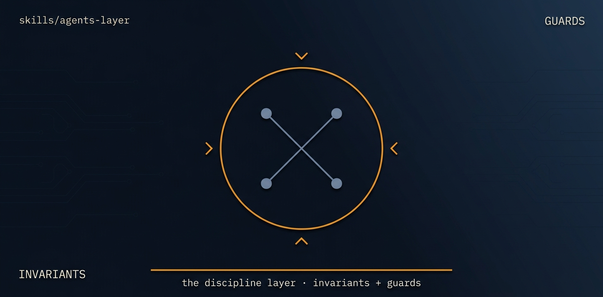

# agents-layer

> **Exploratory — not a live mission.** Labels below may be stale; SKILL.md frontmatter is authoritative. See ../../README.md for the promotion rule.

<p align="center">
  
</p>

> [Tier 3 · one-axis stub→live cutover · full review gate] Fill the live implementation of the agent/service seam recorded in docs/build-plan.md, swapping the frozen stub for the configured agents framework (default eve) one seam-member-group at a time, behind the exact contract the stub froze, then remove the stub.

🟦 **Tier 1 · Infrastructure** — the engine, entry point, setup

# Full description

[Tier 3 · one-axis stub→live cutover · full review gate] Fill the live implementation of the agent/service seam recorded in docs/build-plan.md, swapping the frozen stub for the configured agents framework (default eve) one seam-member-group at a time, behind the exact contract the stub froze, then remove the stub. Use after the build plan is frozen and the typed depth is done; acceptance is contract-tested against the stub fixtures plus local evals, with live deploy left to OPS. NOT for deriving the seam (scaffold-align owns that) and NOT for building typed API/data/UI depth (contract-first-build owns that); this mission only wires the live impl and cuts over the selector. Runs via the autonomous-fleet-core engine. Trigger on: "wire the live agents layer", "swap the agent stub for the real framework", "cut the agent seam over to live", "implement the agents framework behind the stub".

# Source of truth

🟢 **[`SKILL.md`](./SKILL.md)** — agent-facing spec. Anything agents need (process, references, scripts, validation gates) lives there.

This README is a thin human-facing surface. Skill behavior is governed entirely by `SKILL.md` and its references/.

# Quick install

```bash
npx skills add https://github.com/ravidsrk/autonomous-fleet \
  --skill agents-layer -y
```

Then activate in your agent (e.g. Claude Code, Cursor, Grok, Codex, or Mogra) and reference by name.

# See also

- [autonomous-fleet README](../../README.md) — full framework overview
- [AGENTS.md](../../AGENTS.md) — repo conventions for AI coding agents
