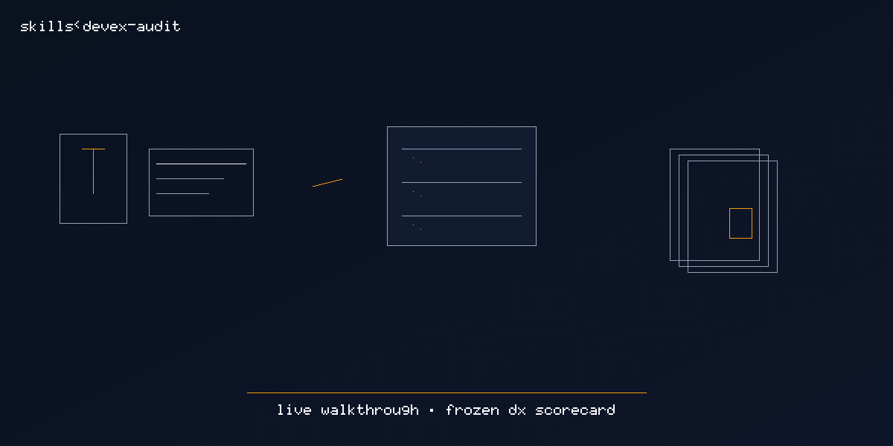

# devex-audit

  

> [Tier 2 · moderate autonomy · full review gate] Freeze a DX scorecard and doc-gap index from a live walkthrough.

🟧 **Tier 2 · Mission** — developer experience audit from gstack devex-review flows

# Full description

[Tier 2] Run a live developer-experience walkthrough, score onboarding friction, and freeze
`docs/devex-scorecard.md` plus `docs/devex-gaps-index.md`. Trigger on: "DX audit", "devex mission",
"audit onboarding", "score the getting started flow".

# Source of truth

🟢 **[`SKILL.md`](./SKILL.md)** — agent-facing spec.

# Quick install

Parked — un-archive from `docs/exploratory/missions/archive/devex-audit/` before promoting.

# See also

- [`docs/gstack-missions-research.md`](../../../../gstack-missions-research.md)
- [gstack `devex-review`](https://github.com/garrytan/gstack/tree/main/devex-review)