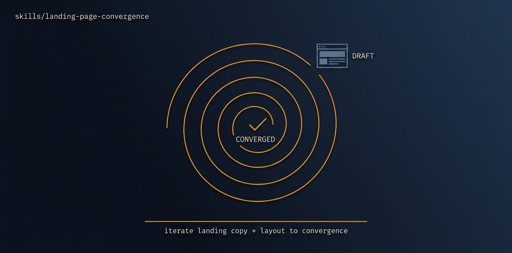

# landing-page-convergence

<p align="center">
  
</p>

> [Tier 2 · moderate autonomy · full review gate] Force a production landing page that has DIVERGED from an approved design into full fidelity with that design - section by section, with a named divergence checklist as the forcing function so it converges instead of drifting.

🟧 **Tier 3 · Mission** — a discrete engineering job, safe to compose

# Full description

[Tier 2 · moderate autonomy · full review gate] Force a production landing page that has DIVERGED from an approved design into full fidelity with that design - section by section, with a named divergence checklist as the forcing function so it converges instead of drifting. Use when a live page no longer matches its design export and needs to be brought back into line (a single page/site, not a whole app - that's design-integration). Extracts the design system, diffs production against it, and closes each divergence as its own PR. Runs via the autonomous-fleet-core engine. Trigger on: "make the landing page match the design", "the production page diverged from the design", "bring the landing page into parity", "fix the landing page to match the mockup".

# Source of truth

🟢 **[`SKILL.md`](./SKILL.md)** — agent-facing spec. Anything agents need (process, references, scripts, validation gates) lives there.

This README is a thin human-facing surface. Skill behavior is governed entirely by `SKILL.md` and its references/.

# Quick install

```bash
npx skills add https://github.com/ravidsrk/autonomous-fleet \
  --skill landing-page-convergence -y
```

Then activate in your agent (e.g. Claude Code, Cursor, Grok, Codex, or Mogra) and reference by name.

# See also

- [autonomous-fleet README](../../README.md) — full framework overview
- [AGENTS.md](../../AGENTS.md) — repo conventions for AI coding agents
