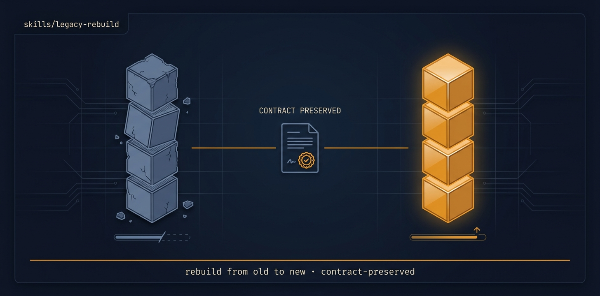

# legacy-rebuild

<p align="center">
  
</p>

> [Tier 3 · high blast radius · expect rework · run deliberately, review the floor + architecture] Adversarially review a legacy app, research the best current architecture, and rebuild it end to end on a modern foundation while PRESERVING everything it currently does.

🟧 **Tier 3 · Mission** — a discrete engineering job, safe to compose

# Full description

[Tier 3 · high blast radius · expect rework · run deliberately, review the floor + architecture] Adversarially review a legacy app, research the best current architecture, and rebuild it end to end on a modern foundation while PRESERVING everything it currently does. Use when an app uses outdated everything (old deps, poor architecture, e.g. JS-inlined-in-HTML, no build/module system) and needs a real modernization, not a patch. Incremental and shippable per PR — NOT a big-bang rewrite — rebuilt against a captured behaviour floor so nothing is silently lost. Runs via the autonomous-fleet-core engine. Trigger on: "rebuild this legacy app", "modernize the whole codebase", "this uses all old versions, rebuild it properly", "re-architect end to end".

# Source of truth

🟢 **[`SKILL.md`](./SKILL.md)** — agent-facing spec. Anything agents need (process, references, scripts, validation gates) lives there.

This README is a thin human-facing surface. Skill behavior is governed entirely by `SKILL.md` and its references/.

# Quick install

```bash
npx skills add https://github.com/ravidsrk/autonomous-fleet \
  --skill legacy-rebuild -y
```

Then activate in your agent (e.g. Claude Code, Cursor, Grok, Codex, or Mogra) and reference by name.

# See also

- [autonomous-fleet README](../../README.md) — full framework overview
- [AGENTS.md](../../AGENTS.md) — repo conventions for AI coding agents
