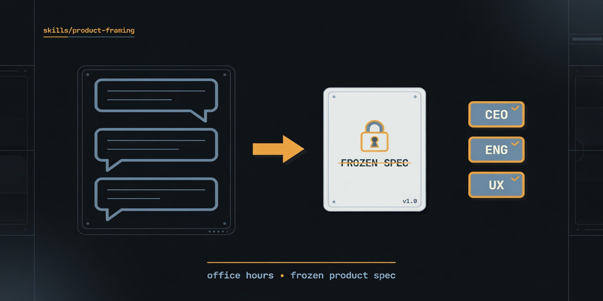

# product-framing

  

> [Tier 2 · moderate autonomy · full review gate] Freeze a product spec before any code ships.

🟧 **Tier 2 · Mission** — pre-build framing from gstack office-hours + plan reviews

# Full description

[Tier 2] Turn vague product intent into a frozen `docs/product-spec.md` using gstack-style
office-hours forcing questions and CEO/design/eng plan reviews. No implementation PRs in this
mission. Trigger on: "frame this product", "office hours on this idea", "freeze the product spec".

# Source of truth

🟢 **[`SKILL.md`](./SKILL.md)** — agent-facing spec.

# Quick install

Parked — un-archive from `docs/exploratory/missions/archive/product-framing/` before promoting or
invoking manually as a one-off operator pass.

# See also

- [`docs/gstack-missions-research.md`](../../../../gstack-missions-research.md)
- [gstack `office-hours`](https://github.com/garrytan/gstack/tree/main/office-hours)