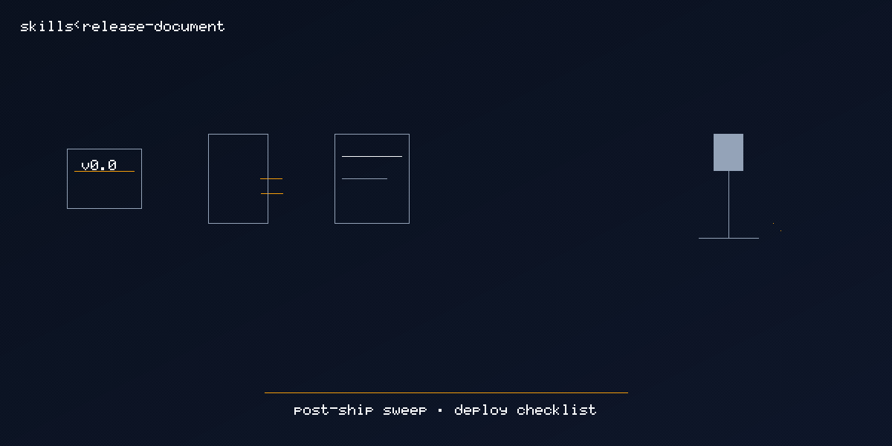

# release-document

  

> [Tier 2 · moderate autonomy · full review gate] Post-ship doc sweep and deploy checklist.

🟧 **Tier 2 · Mission** — release documentation from gstack document-release + ship flows

# Full description

[Tier 2] After a version lands, sweep user-facing docs and freeze `docs/release-doc-checklist.md`
with changelog, deploy, and canary rows. Trigger on: "document this release", "post-ship docs",
"release documentation mission".

# Source of truth

🟢 **[`SKILL.md`](./SKILL.md)** — agent-facing spec.

# Quick install

Parked — un-archive from `docs/exploratory/missions/archive/release-document/` before promoting.

# See also

- [`docs/gstack-missions-research.md`](../../../../gstack-missions-research.md)
- [gstack `document-release`](https://github.com/garrytan/gstack/tree/main/document-release)