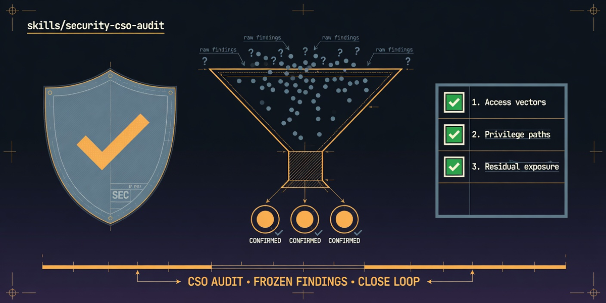

# security-cso-audit

  

> [Tier 2 · moderate autonomy · full review gate] CSO security audit with frozen findings.

🟧 **Tier 2 · Mission** — gstack `/cso` infrastructure-first audit + fix loop

# Full description

[Tier 2] Run secrets archaeology, supply chain, CI/CD, OWASP, STRIDE, and LLM/skill supply chain
checks; freeze confirmed findings; remediate one PR at a time with skeptic narrowing. Trigger on:
"CSO audit", "security audit mission", "OWASP review", "threat model this repo".

# Source of truth

🟢 **[`SKILL.md`](./SKILL.md)** — agent-facing spec.

# Quick install

Exploratory only — see `docs/exploratory/missions/README.md` promotion criteria.

# See also

- [`docs/gstack-missions-research.md`](../../../../gstack-missions-research.md)
- [gstack `cso`](https://github.com/garrytan/gstack/tree/main/cso)