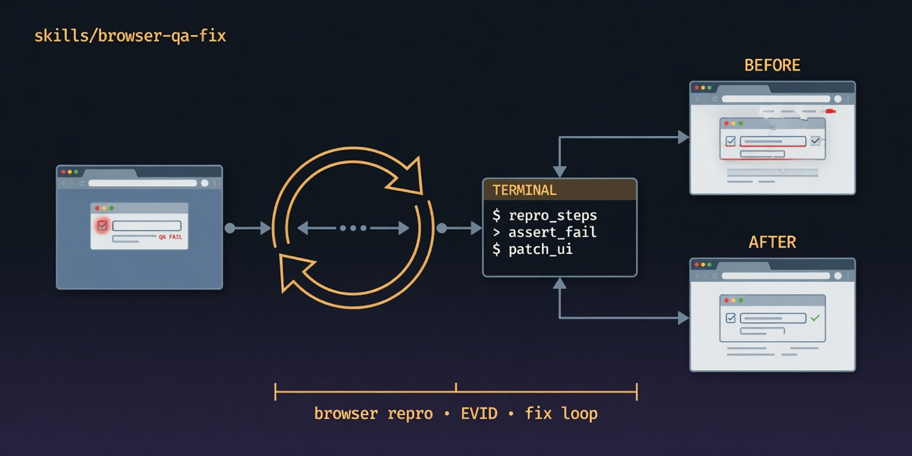

# browser-qa-fix

  

> [Tier 2 · moderate autonomy · full review gate] Browser QA with EVID repros and a fix loop.

🟧 **Tier 2 · Mission** — gstack `/qa` + `/browse` translated to fleet worktrees

# Full description

[Tier 2] Systematically test a web app via real browser sessions, freeze defects with screenshot
EVID, fix one PR per bug, and re-verify until health threshold is met. Trigger on: "browser qa fix",
"test the site and fix", "QA this app on staging".

# Source of truth

🟢 **[`SKILL.md`](./SKILL.md)** — agent-facing spec.

# Quick install

Exploratory only — see `docs/exploratory/missions/README.md` promotion criteria.

# See also

- [`docs/gstack-missions-research.md`](../../../gstack-missions-research.md)
- [gstack `qa`](https://github.com/garrytan/gstack/tree/main/qa)