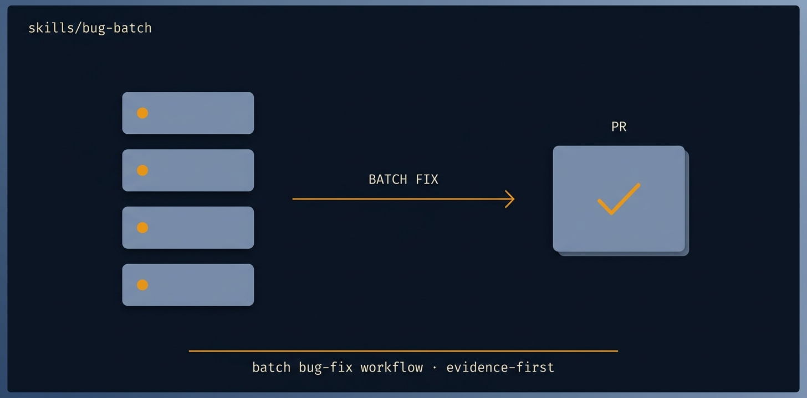

# bug-batch

<p align="center">
  
</p>

> [Tier 2 · moderate autonomy · full review gate · reproduce-first required] Close a batch of bugs — from a list, an issue tracker, or a described set — one PR per bug, each gated by a FAILING TEST written first that reproduces the bug, then a fix that turns it green.

🟧 **Tier 3 · Mission** — a discrete engineering job, safe to compose

# Full description

[Tier 2 · moderate autonomy · full review gate · reproduce-first required] Close a batch of bugs — from a list, an issue tracker, or a described set — one PR per bug, each gated by a FAILING TEST written first that reproduces the bug, then a fix that turns it green. Use for a backlog of bugs, a tracker label, or a known cluster of defects. Bug-fixes are among the categories agents are WEAKEST at (they need exact, not approximate, changes), so this mission forces exactness: prove the bug with a red test before fixing. Does not add features. Runs via the autonomous-fleet-core engine. Trigger on: "fix these bugs", "work through the bug backlog", "close the bugs labelled X", "fix this list of issues", "batch bug fixing".

# Source of truth

🟢 **[`SKILL.md`](./SKILL.md)** — agent-facing spec. Anything agents need (process, references, scripts, validation gates) lives there.

This README is a thin human-facing surface. Skill behavior is governed entirely by `SKILL.md` and its references/.

# Quick install

```bash
npx skills add https://github.com/ravidsrk/autonomous-fleet \
  --skill bug-batch -y
```

Then activate in your agent (e.g. Claude Code, Cursor, Grok, Codex, or Mogra) and reference by name.

# See also

- [autonomous-fleet README](../../README.md) — full framework overview
- [AGENTS.md](../../AGENTS.md) — repo conventions for AI coding agents
