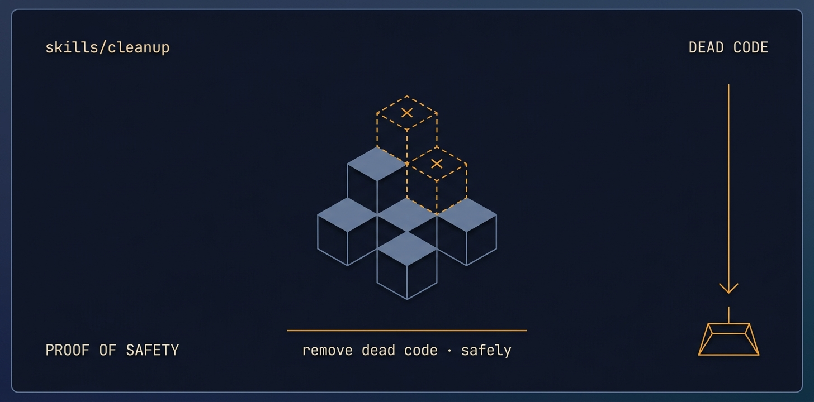

# cleanup

<p align="center">
  
</p>

> [Tier 1 · merge-friendly chore-category work · lower-risk when scoped] Targeted code-health pass — remove dead code, kill duplication, fix a named anti-pattern, tidy structure — WITHOUT re-architecting.

🟧 **Tier 3 · Mission** — a discrete engineering job, safe to compose

# Full description

[Tier 1 · merge-friendly chore-category work · lower-risk when scoped] Targeted code-health pass — remove dead code, kill duplication, fix a named anti-pattern, tidy structure — WITHOUT re-architecting. The light counterpart to legacy-rebuild: improves the code as it is, preserves all behaviour, no big structural change. Use for "clean up this mess", tech-debt paydown, removing cruft after a feature, or eliminating a specific smell. Behaviour-preserving by definition; every change covered by existing or added tests proving nothing broke. Runs fully autonomously via the autonomous-fleet-core engine. Trigger on: "clean up the code", "remove dead code", "reduce duplication", "tidy this up", "pay down tech debt", "fix this anti-pattern" (when a full rebuild is NOT wanted).

# Source of truth

🟢 **[`SKILL.md`](./SKILL.md)** — agent-facing spec. Anything agents need (process, references, scripts, validation gates) lives there.

This README is a thin human-facing surface. Skill behavior is governed entirely by `SKILL.md` and its references/.

# Quick install

```bash
npx skills add https://github.com/ravidsrk/autonomous-fleet \
  --skill cleanup -y
```

Then activate in your agent (e.g. Claude Code, Cursor, Grok, Codex, or Mogra) and reference by name.

# See also

- [autonomous-fleet README](../../README.md) — full framework overview
- [AGENTS.md](../../AGENTS.md) — repo conventions for AI coding agents
