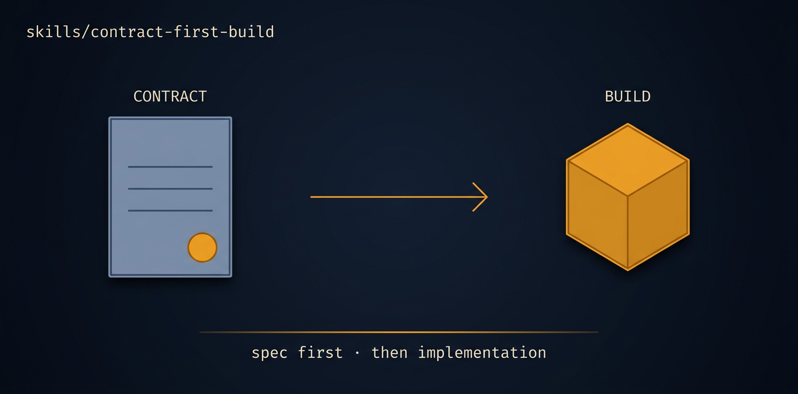

# contract-first-build

> **Exploratory — not a live mission.** Labels below may be stale; SKILL.md frontmatter is authoritative. See ../../README.md for the promotion rule.

<p align="center">
  
</p>

> [Tier 3 · high blast radius · expect rework · review the frozen build plan] Build the typed product depth (API/router, server, data/ORM, auth, payments, integrations, read-path persistence) to full depth against a PRE-FROZEN boundary, consuming docs/build-plan.md (the seam contract, invariants, and work-areas frozen by scaffold-align) without re-deriving any of it.

🟧 **Tier 3 · Mission** — a discrete engineering job, safe to compose

# Full description

[Tier 3 · high blast radius · expect rework · review the frozen build plan] Build the typed product depth (API/router, server, data/ORM, auth, payments, integrations, read-path persistence) to full depth against a PRE-FROZEN boundary, consuming docs/build-plan.md (the seam contract, invariants, and work-areas frozen by scaffold-align) without re-deriving any of it. Use after the build plan is frozen and the agents-live row can stay stubbed, to fill every typed work-area to real depth against the discovered seam plus its stub fixtures. NOT for deriving the boundary (scaffold-align owns that) and NOT for wiring the live agents impl (agents-layer owns that): never touch the live impl file or widen the seam interface. Expect rework; the artifact to eyeball is the pre-frozen docs/build-plan.md, not one this mission invents. Runs via the autonomous-fleet-core engine. Trigger on: "build the contract depth", "implement the build plan", "build the API/data/auth/payments layers", "fill in the typed product".

# Source of truth

🟢 **[`SKILL.md`](./SKILL.md)** — agent-facing spec. Anything agents need (process, references, scripts, validation gates) lives there.

This README is a thin human-facing surface. Skill behavior is governed entirely by `SKILL.md` and its references/.

# Quick install

```bash
npx skills add https://github.com/ravidsrk/autonomous-fleet \
  --skill contract-first-build -y
```

Then activate in your agent (e.g. Claude Code, Cursor, Grok, Codex, or Mogra) and reference by name.

# See also

- [autonomous-fleet README](../../README.md) — full framework overview
- [AGENTS.md](../../AGENTS.md) — repo conventions for AI coding agents
