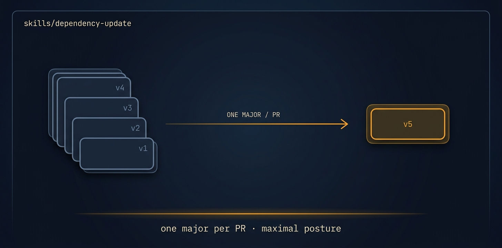

# dependency-update

<p align="center">
  
</p>

> [Tier 1 · among the highest cross-agent merge-success categories (build/chore) · safe to run unattended] Update a repo's dependencies to current versions, fix the breakages each bump causes, and keep the suite green — one PR per logical group.

🟧 **Tier 3 · Mission** — a discrete engineering job, safe to compose

# Full description

[Tier 1 · among the highest cross-agent merge-success categories (build/chore) · safe to run unattended] Update a repo's dependencies to current versions, fix the breakages each bump causes, and keep the suite green — one PR per logical group. Use when deps are stale, for routine maintenance, to clear security advisories, or before building on an old base. Handles version bumps, lockfile updates, and the code/config changes a bump requires (deprecations, renamed APIs, breaking changes); does NOT add features. Runs fully autonomously via the autonomous-fleet-core engine. Trigger on: "update dependencies", "bump packages", "our deps are out of date", "upgrade to latest", "fix security advisories", "dependency maintenance".

# Source of truth

🟢 **[`SKILL.md`](./SKILL.md)** — agent-facing spec. Anything agents need (process, references, scripts, validation gates) lives there.

This README is a thin human-facing surface. Skill behavior is governed entirely by `SKILL.md` and its references/.

# Quick install

```bash
npx skills add https://github.com/ravidsrk/autonomous-fleet \
  --skill dependency-update -y
```

Then activate in your agent (e.g. Claude Code, Cursor, Grok, Codex, or Mogra) and reference by name.

# See also

- [autonomous-fleet README](../../README.md) — full framework overview
- [AGENTS.md](../../AGENTS.md) — repo conventions for AI coding agents
