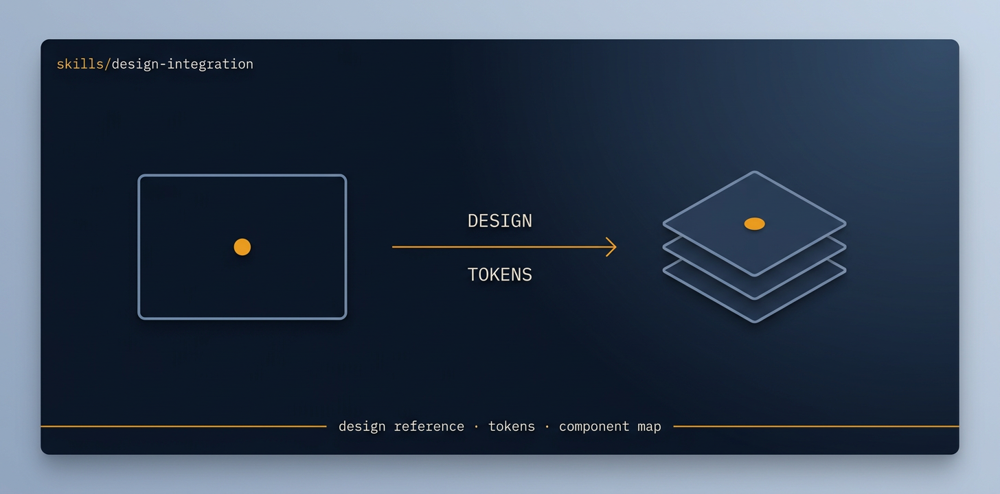

# design-integration

<p align="center">
  
</p>

> [Tier 2 · moderate autonomy · full review gate] Adopt a fresh design across an existing product to full parity - VISUAL and FEATURE-WISE.

🟧 **Tier 3 · Mission** — a discrete engineering job, safe to compose

# Full description

[Tier 2 · moderate autonomy · full review gate] Adopt a fresh design across an existing product to full parity - VISUAL and FEATURE-WISE. Import the design (Claude Design export/URL or the claude_design MCP connector), reskin every existing screen to it, and where the design implies a feature the product lacks, design-and-build it; nothing the old product did is lost. Use for a whole-app redesign adoption, not a single page (the parked single-page variant lives under docs/exploratory/missions/archive/landing-page-convergence/). Reuses the existing backend; rewires the UI to the new design and fills gaps to full depth. Runs via the autonomous-fleet-core engine. Trigger on: "adopt this design across the product", "integrate the new design end to end", "make the app match this design fully", "redesign the whole app to this".

# Source of truth

🟢 **[`SKILL.md`](./SKILL.md)** — agent-facing spec. Anything agents need (process, references, scripts, validation gates) lives there.

This README is a thin human-facing surface. Skill behavior is governed entirely by `SKILL.md` and its references/.

# Quick install

```bash
npx skills add https://github.com/ravidsrk/autonomous-fleet \
  --skill design-integration -y
```

Then activate in your agent (e.g. Claude Code, Cursor, Grok, Codex, or Mogra) and reference by name.

# See also

- [autonomous-fleet README](../../README.md) — full framework overview
- [AGENTS.md](../../AGENTS.md) — repo conventions for AI coding agents
