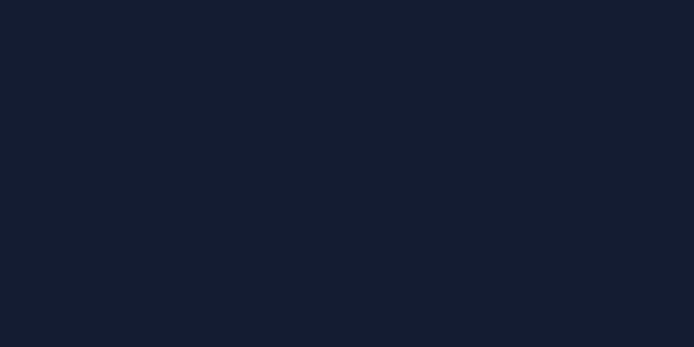

# incident-investigate

  

> [Tier 2 · moderate autonomy · full review gate] RCA + regression test for production incidents.

🟧 **Tier 2 · Mission** — incident response from gstack investigate + retro + learn

# Full description

[Tier 2] Investigate an incident, freeze `docs/incident-rca.md`, and merge a regression test for the
confirmed root cause. Trigger on: "investigate this incident", "root cause analysis", "incident
mission", "write the RCA".

# Source of truth

🟢 **[`SKILL.md`](./SKILL.md)** — agent-facing spec.

# Quick install

Not shipped — exploratory only. Copy from `docs/exploratory/missions/incident-investigate/` when promoting.

# See also

- [`docs/gstack-missions-research.md`](../../../gstack-missions-research.md)
- [gstack `investigate`](https://github.com/garrytan/gstack/tree/main/investigate)