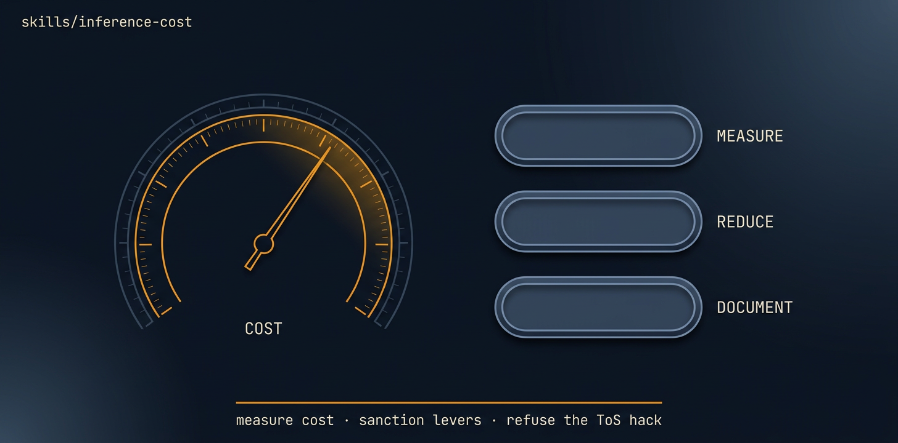

# inference-cost

<p align="center">
  
</p>

> [Tier 2 - measurement-first cost optimization - full review gate] Reduce AI inference spend while holding output quality constant.

🟧 **Tier 3 · Mission** — a discrete engineering job, safe to compose

# Full description

[Tier 2 - measurement-first cost optimization - full review gate] Reduce AI inference spend while holding output quality constant. Use when a repo has high LLM/API spend, needs cost controls, or wants model routing, prompt caching, batch/flex-tier pricing, provider abstraction, or token-hygiene cleanup. First gate is a baseline cost+quality harness; ship only sanctioned levers and block output-quality regressions. Hard-refuse subscription-token-as-backend/token-pool-proxy hacks; use billed provider API keys from env only. Runs via autonomous-fleet-core. Trigger on: "reduce inference cost", "optimize LLM spend", "lower token usage", "route cheaper models".

# Source of truth

🟢 **[`SKILL.md`](./SKILL.md)** — agent-facing spec. Anything agents need (process, references, scripts, validation gates) lives there.

This README is a thin human-facing surface. Skill behavior is governed entirely by `SKILL.md` and its references/.

# Quick install

```bash
npx skills add https://github.com/ravidsrk/autonomous-fleet \
  --skill inference-cost -y
```

Then activate in your agent (e.g. Claude Code, Cursor, Grok, Codex, or Mogra) and reference by name.

# See also

- [autonomous-fleet README](../../README.md) — full framework overview
- [AGENTS.md](../../AGENTS.md) — repo conventions for AI coding agents
