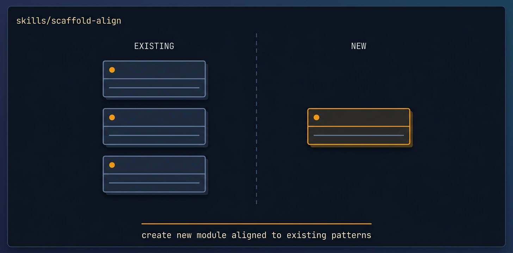

# scaffold-align

<p align="center">
  
</p>

> [Tier 1 · verification-led · safe to run unattended] Self-orient to a design+spec handoff, certify the scaffold builds green, certify the agent/service seam (its typed stub/live boundary) and HARDEN the stub so it exercises the WHOLE contract, then FREEZE docs/build-plan.md as the single handoff artifact the downstream build missions consume.

🟧 **Tier 3 · Mission** — a discrete engineering job, safe to compose

# Full description

[Tier 1 · verification-led · safe to run unattended] Self-orient to a design+spec handoff, certify the scaffold builds green, certify the agent/service seam (its typed stub/live boundary) and HARDEN the stub so it exercises the WHOLE contract, then FREEZE docs/build-plan.md as the single handoff artifact the downstream build missions consume. This is verification and freeze work only: it confirms the scaffold typechecks, lints, and builds via the repo's own scripts, enumerates the seam, and records discovered per-product facts in the artifact. NOT for building product depth (that is contract-first-build) and NOT for wiring the live agents impl (that is agents-layer) — it leaves the seam stubbed and the live impl untouched. Runs via the autonomous-fleet-core engine. Trigger on: "align the scaffold", "freeze the build plan", "certify the handoff", "prep this handoff for the fleet", "orient to the design+spec handoff".

# Source of truth

🟢 **[`SKILL.md`](./SKILL.md)** — agent-facing spec. Anything agents need (process, references, scripts, validation gates) lives there.

This README is a thin human-facing surface. Skill behavior is governed entirely by `SKILL.md` and its references/.

# Quick install

```bash
npx skills add https://github.com/ravidsrk/autonomous-fleet \
  --skill scaffold-align -y
```

Then activate in your agent (e.g. Claude Code, Cursor, Grok, Codex, or Mogra) and reference by name.

# See also

- [autonomous-fleet README](../../README.md) — full framework overview
- [AGENTS.md](../../AGENTS.md) — repo conventions for AI coding agents
