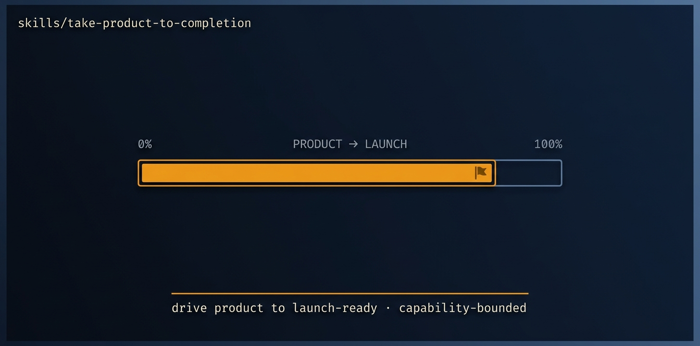

# take-product-to-completion

<p align="center">
  
</p>

> [Tier 3 · high blast radius · expect rework · run deliberately, review the scope artifact] Take a STALLED product to a full-fledged, complete, shippable state — adversarial review of what exists, research the market, freeze a COHERENT PRODUCT BOUNDARY, then build everything inside it to full depth (no stubs, no half-built screens) and rebuild the landing page.

🟧 **Tier 3 · Mission** — a discrete engineering job, safe to compose

# Full description

[Tier 3 · high blast radius · expect rework · run deliberately, review the scope artifact] Take a STALLED product to a full-fledged, complete, shippable state — adversarial review of what exists, research the market, freeze a COHERENT PRODUCT BOUNDARY, then build everything inside it to full depth (no stubs, no half-built screens) and rebuild the landing page. Use when a product has been started but never finished, when "done" keeps expanding so nothing ships, or when you need a side project driven to a credible v1. NOT for a thin MVP — the user wants real depth — but the boundary is frozen once so the run converges instead of expanding forever. Highest-risk mission: feature/cross-module work has no category in arXiv 2601.15195, so expect rework; the scope artifact (the IN/ROADMAP/FIX boundary) is the thing to eyeball. Runs via the autonomous-fleet-core engine. Trigger on: "take this product to the finish line", "finish this stalled project", "make this shippable end to end", "complete the whole product".

# Source of truth

🟢 **[`SKILL.md`](./SKILL.md)** — agent-facing spec. Anything agents need (process, references, scripts, validation gates) lives there.

This README is a thin human-facing surface. Skill behavior is governed entirely by `SKILL.md` and its references/.

# Quick install

```bash
npx skills add https://github.com/ravidsrk/autonomous-fleet \
  --skill take-product-to-completion -y
```

Then activate in your agent (e.g. Claude Code, Cursor, Grok, Codex, or Mogra) and reference by name.

# See also

- [autonomous-fleet README](../../README.md) — full framework overview
- [AGENTS.md](../../AGENTS.md) — repo conventions for AI coding agents
