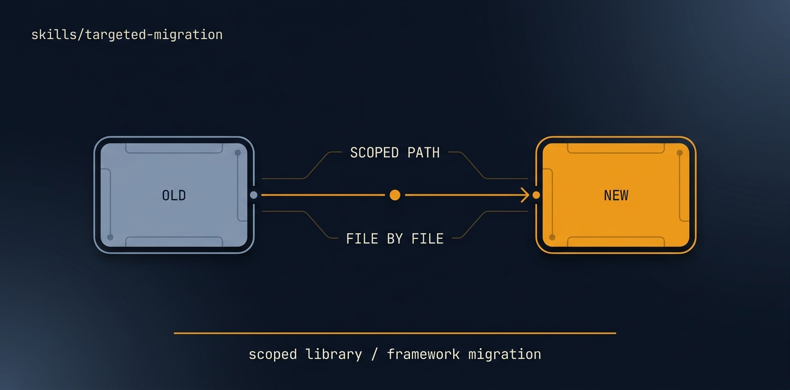

# targeted-migration

<p align="center">
  
</p>

> [Tier 2 · moderate autonomy · full review gate] Migrate ONE axis of a codebase — a framework version, a library swap, a language/runtime bump, a database/ORM change, an API-version move — while preserving everything else and keeping the suite green.

🟧 **Tier 3 · Mission** — a discrete engineering job, safe to compose

# Full description

[Tier 2 · moderate autonomy · full review gate] Migrate ONE axis of a codebase — a framework version, a library swap, a language/runtime bump, a database/ORM change, an API-version move — while preserving everything else and keeping the suite green. Use for a single deliberate migration that's too big for dependency-update but is NOT a full rebuild: React class→hooks, a major framework major-version, swapping one library for another, a DB engine/ORM change, a REST→GraphQL of one surface. Changes one axis; preserves architecture and behaviour on every other axis. Runs via the autonomous-fleet-core engine. Trigger on: "migrate to X", "swap library A for B", "upgrade framework to v-next", "move from REST to GraphQL", "migrate the database/ORM".

# Source of truth

🟢 **[`SKILL.md`](./SKILL.md)** — agent-facing spec. Anything agents need (process, references, scripts, validation gates) lives there.

This README is a thin human-facing surface. Skill behavior is governed entirely by `SKILL.md` and its references/.

# Quick install

```bash
npx skills add https://github.com/ravidsrk/autonomous-fleet \
  --skill targeted-migration -y
```

Then activate in your agent (e.g. Claude Code, Cursor, Grok, Codex, or Mogra) and reference by name.

# See also

- [autonomous-fleet README](../../README.md) — full framework overview
- [AGENTS.md](../../AGENTS.md) — repo conventions for AI coding agents
