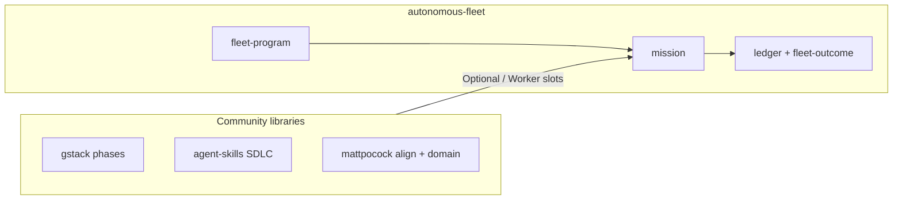

# Research: Community skills mix-and-match

**Date:** 2026-06-20  
**Scope:** [gstack](https://github.com/garrytan/gstack), [agent-skills](https://github.com/addyosmani/agent-skills), and [mattpocock/skills](https://github.com/mattpocock/skills) — how they compose with autonomous-fleet, proposed broader missions, overwhelm reduction, and borrowable practices.

**Local clones:** `.research/gstack/`, `.research/agent-skills/`, `.research/skills/`

**Operational reference:** `skills/autonomous-fleet-core/references/community-skills.md`

---

## Executive summary

| Question | Answer |
|----------|--------|
| Can we mix and match? | **Yes** — community skills attach as **Optional** (coordinator) or **Worker** (DISPATCH) inside fleet missions; `fleet-program` sequences missions. |
| Who orchestrates? | **autonomous-fleet** owns mission order, BASE, ledgers, and `fleet-outcome`; community repos own phase tactics. |
| Why overwhelm? | Users install 90+ skills with no router. Fix: **one entry** (`fleet-program` preset or umbrella), **max 3 active skills** on coordinator, **bundles** not catalogs. |
| What to borrow? | gstack: browser QA, ship gate, `benefits-from`; agent-skills: SDLC behaviors, `/build auto`, orchestration anti-patterns; mattpocock: user-invoked alignment, `CONTEXT.md`/ADR, setup skill. |

---

## 1. What each repo is

| Repo | Scale | Mental model | Orchestration |
|------|-------|--------------|---------------|
| **gstack** | ~59 `SKILL.md` | Virtual eng team (CEO, design, eng, QA, security, ship) | Slash commands; user chains (`/office-hours` → `/autoplan` → implement → `/ship`) |
| **agent-skills** | 24 skills + 7 commands | SDLC pipeline | `/spec` → `/plan` → `/build` → `/test` → `/review` → `/ship`; skills auto-trigger by activity |
| **mattpocock/skills** | ~25 skills | Small opinionated primitives | `/grill-me`, `/domain-modeling`, `/triage`; composable, no campaign layer |
| **autonomous-fleet** | 21 skills | Mission-centric engineering | core + adapter + **one mission**; `fleet-program` for DAGs; file ledgers + `fleet-outcome` |

### Architectural contrast



- **Community repos** answer: *what do I do in this phase?*
- **autonomous-fleet** answers: *which phase runs when, on what branch, with what proof of done?*

---

## 2. Mix-and-match model

### Attachment rules (from `composition.md`)

| Section | Who loads | Community skills |
|---------|-----------|------------------|
| `## Required skills` | Coordinator | Never — fleet core + adapter + mission only |
| `## Optional skills` | Coordinator | Alignment, review gauntlets, MCP setup — **0–2 max** |
| `## Worker skills` | Workers via DISPATCH | TDD, frontend-design, `qa`, security simplify |

**Never** load two mission skills or three routers (`fleet-program` + `autoplan` + `using-agent-skills`) in one coordinator session.

### Mix-and-match matrix

| Community skill | Fleet slot | Use with mission(s) |
|-----------------|------------|---------------------|
| `office-hours` | Optional | `take-product-to-completion` (T3 boundary) |
| `grill-with-docs` / `grill-me` | Pre-gate (user-invoked) | Before Tier 3 missions |
| `autoplan` | Optional pre-build | Greenfield; save plan, do not implement in same pass as fleet mission |
| `planning-and-task-breakdown` | Worker / pre-phase | Custom build missions; agent-skills `/plan` |
| `incremental-implementation` + `test-driven-development` | Worker | `bug-batch`, `test-coverage`, build phases |
| `qa` / `qa-only` | Worker / post-gate | `design-integration`, `landing-page-convergence`, post-campaign |
| `review` / `ship` | Post-gate | After `secure-ship` / `ship-with-proof` docs node |
| `cso` / `health` | Optional | `adversarial-review-and-fix`, `quality-gate` |
| `domain-modeling` | Worker | `doc-sync`, `take-product-to-completion` (CONTEXT/ADR) |
| `security-and-hardening` | Worker | `adversarial-review-and-fix` |
| `frontend-ui-engineering` | Worker | `design-integration`, `landing-page-convergence` |

Existing integration example (`take-product-to-completion`):

```markdown
| `office-hours` | Boundary (T3) is ambiguous and user wants product framing | Use T1+T2 research only |
```

---

## 3. Broader missions (fleet-program presets)

New presets (YAML in `scripts/campaigns/`, docs in `fleet-program/references/campaigns.md`):

| Preset | User says | Mission chain | Community hooks |
|--------|-----------|---------------|-----------------|
| **ship-with-proof** | "Ship this branch safely" | audit → tests → docs | Post: `ship`, `qa` |
| **align-then-ship** | "Finish this stalled product" | `take-product-to-completion` | Pre: `grill-with-docs`, `office-hours` |
| **quality-gate** | "Is this production-ready?" | audit → tests | Post: `qa-only`, `health` (report-only) |

**Pre-gates** and **post-gates** are coordinator steps documented on the campaign YAML — they do not add fleet mission nodes. They prevent loading alignment skills mid-mission token soup.

### Starter bundles (user-facing)

| Bundle | Entry | Install community? |
|--------|-------|-------------------|
| **A — Fix my repo** | `fleet-program` → `repo-health` | No |
| **B — Ship safely** | `fleet-program` → `ship-with-proof` | Optional: gstack ship/qa |
| **C — Finish product** | `fleet-program` → `align-then-ship` | Recommended: grill or office-hours |
| **D — Greenfield feature** | Human `/spec` + `/plan` → single mission | agent-skills plugin |

Rule: humans pick **bundle + repo**; fleet picks **mission**; workers pick **domain skill**.

---

## 4. Overwhelm reduction

| Pain | Root cause | Fleet-native fix |
|------|------------|------------------|
| Too many skills visible | Full library install | Bundles; install community skills per bundle |
| Wrong skill fires | All model-invoked | User-invoked alignment (`disable-model-invocation`) |
| Token soup | Coordinator loads everything | Max 3 coordinator skills; optional ≤2 |
| No "done" | Slash command ends when model stops | `fleet-outcome` + `validate-fleet-outcome.sh` |
| User chains 6 slash commands | User is orchestrator | `fleet-program` owns sequence |

### Three-layer mental model

1. **Umbrella / program** — pick one preset (`repo-health`, `ship-with-proof`, …)
2. **Mission** — one active mission skill per repo
3. **Community** — optional pre/post gates and worker DISPATCH only

---

## 5. Practices to borrow (implementation backlog)

### From gstack

| Practice | Borrow into fleet |
|----------|-------------------|
| `benefits-from: [office-hours]` metadata | Mission Optional tables: "run X before Y" |
| `qa-only` vs `qa` | Post-gate report-only mode on campaigns |
| Ship gate ("do NOT push/PR directly") | Document in `community-skills.md`; align with PR-per-task |
| Browser-native QA | Worker on UI missions |
| `context-save` / `context-restore` | Tier 3 multi-session handoff |
| `plan-tune` | User prefs in `DECISIONS.md` or adapter |
| Preamble tiers | Keep `engine.md` tier-3 only when coordinating |

### From agent-skills

| Practice | Borrow into fleet |
|----------|-------------------|
| `using-agent-skills` decision tree | Slim phase router in umbrella catalog |
| Core behaviors (assumptions, push-back, simplicity, scope) | Short block in `engine.md` coordinator preamble |
| `/build auto` contract | Worker batch gates: one approval, one commit per task, STOP on ambiguity |
| `references/orchestration-patterns.md` | Cross-link from `composition.md`; personas ≠ nested missions |
| Explicit spec paths (`SPEC.md`, `docs/SPEC.md`, `spec/*`) | Tier 3 boundary artifacts |
| Hooks (session-start) | Optional `validate-all.sh` on mission boot |

### From mattpocock

| Practice | Borrow into fleet |
|----------|-------------------|
| User-invoked vs model-invoked | Pre-gates are user-invoked alignment skills |
| `CONTEXT.md` + ADR rules | `doc-sync`, `take-product-to-completion` artifacts |
| `setup-matt-pocock-skills` pattern | Future `setup-autonomous-fleet` meta-skill |
| Prose `/skill` invocation | Matches Worker DISPATCH — no `../` cross-links |
| `deprecated/` skill lifecycle | As fleet catalog grows |
| `writing-great-skills` | Mission authoring quality bar |

---

## 6. Implementation phases

| Phase | Work | Status |
|-------|------|--------|
| **1** | Research doc, `community-skills.md`, campaign presets, routing | Done |
| **2** | Optional/Worker on `design-integration`, `landing-page-convergence`, `adversarial-review-and-fix` | Done |
| **3** | Coordinator behaviors in `engine.md` | Done |
| **4** | `setup-autonomous-fleet` + `docs/agents/fleet-config.md` | Done |
| **5** | External dogfood pack `ship-with-proof-gemoji.md` | Partial — one interactive (non-headless) dogfood on a fork clone (`ravidsrk/gemoji` @ `1541ce9`); not upstreamed; headless run pending grok auth. Evidence: `docs/external-dogfood/ship-with-proof-evidence.md` |

---

## 7. Related docs

| Doc | Topic |
|-----|-------|
| `docs/research-skill-composition.md` | Fleet composition model |
| `docs/research-runtime-loops-and-goals.md` | Native goal binding |
| `skills/autonomous-fleet-core/references/composition.md` | Required / Optional / Worker |
| `skills/autonomous-fleet-core/references/community-skills.md` | Install + mix-and-match catalog |
| `skills/fleet-program/references/campaigns.md` | Campaign DAG presets |