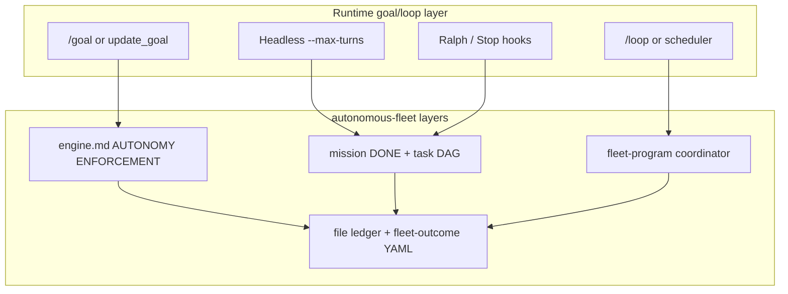

# Research: Runtime loops, goals, and fleet orchestration integration

**Date:** 2026-06-20  
**Scope:** Compare native goal/loop primitives in Codex, Claude Code, and Grok Build (2026); map them to autonomous-fleet's engine, adapters, and `fleet-program`; recommend how to bind runtime autonomy to file-ledger truth.

---

## Executive summary

| Runtime | Native primitive | What it does | Stops when |
|---------|------------------|--------------|------------|
| **Codex** | `/goal` (+ `/plan`) | Persistent objective; Codex loops plan → act → test → review | Task done, paused, budget, or user input |
| **Claude Code** | `/goal` (+ Stop hooks, `/ralph-loop`) | Condition checked by fast model after each turn; auto-starts next turn | Evaluator confirms condition OR `/goal clear` |
| **Grok Build** | `/goal` + `update_goal` tool | Goal mode across turns; agent reports progress/completion | `update_goal(completed: true)` OR `blocked_reason` |
| **All three** | `/loop` / scheduler | Periodic re-prompt on interval | User stops, expiry, or agent decides done |
| **Claude (community)** | Ralph Wiggum (`/ralph-loop`) | Stop hook re-feeds same prompt; file/git state is memory | `<promise>` tag or `--max-iterations` |
| **Grok (headless)** | `--max-turns`, `--check` | Bounded agentic turns in one invocation | Turn budget or verification pass |
| **Orca** | `orchestration check --wait` loop | Coordinator blocks on worker_done / gates | Mission DONE in ledger (manual loop) |

**Convergence (2026):** Every major coding agent now exposes **goal mode** — an outer loop that keeps working until a **verifiable DONE condition** holds. autonomous-fleet already implements the same idea in software: **file-ledger boolean gates**, mission DONE conditions, `fleet-outcome` YAML, and `fleet-program` campaign `PHASE: DONE`.

**Recommendation:** Treat native goals as the **runtime enforcement layer** and file ledgers as the **source of truth**. Adapters should bind `SET_GOAL` / `UPDATE_GOAL` / `GOAL_COMPLETE` primitives to each host's API, with completion gated on ledger + `fleet-outcome` validation — never on model self-assessment alone.

---

## 1. Landscape: what each runtime offers

### 1.1 OpenAI Codex — `/goal`

**Docs:** [Codex app commands](https://developers.openai.com/codex/app/commands)

| Aspect | Detail |
|--------|--------|
| **Command** | `/goal` — set persistent goal; `/plan` first to shape it |
| **Enable** | `features.goals = true` in `config.toml` or `codex features enable goals` |
| **Loop** | Plan → act → test → review → iterate until done/blocked/budget |
| **UI** | Goal progress controls above composer |
| **Pairing** | `/plan` for ambiguity; `/review` for code review mode |

Codex goals are **session-scoped objectives** with built-in iteration. The agent owns the loop; the user sets the north star.

**Fleet analogue:** Mission DONE condition + AUTONOMY ENFORCEMENT block in `engine.md` — same intent, but fleet uses **files** as the completion oracle, not a UI goal chip.

---

### 1.2 Claude Code — `/goal`

**Docs:** [Keep Claude working toward a goal](https://code.claude.com/docs/en/goal) (v2.1.139+)

| Aspect | Detail |
|--------|--------|
| **Command** | `/goal <condition>` — one active goal per session |
| **Mechanism** | Prompt-based **Stop hook**: fast model (default Haiku) evaluates condition after each turn |
| **Auto-start** | Setting a goal starts a turn immediately; condition is the directive |
| **Status** | `/goal` (no args) — elapsed time, turns, tokens, evaluator reason |
| **Clear** | `/goal clear` (aliases: stop, off, reset, cancel) |
| **Non-interactive** | `claude -p "/goal CHANGELOG.md has an entry for every PR merged this week"` |
| **Resume** | Active goals restore on `--resume` / `--continue` (timer resets) |
| **Requirements** | Trust dialog accepted; unavailable if `disableAllHooks` |

**Evaluator constraint:** The evaluator does **not** call tools — it judges only what Claude surfaced in the transcript. Effective conditions must reference outputs Claude can produce ("`npm test` exits 0", "`git status` is clean").

**Related primitives:**

| Primitive | Role |
|-----------|------|
| `/loop` | Time-based re-prompt (interval), not condition-based |
| Auto mode | Approves tools within a turn; does **not** start next turn |
| Stop hooks | Generalized version of `/goal`; Ralph uses these |
| `/ralph-loop` | Community plugin — re-feeds **same prompt** on stop; completion via `<promise>` tag |

**Fleet analogue:** AUTONOMY ENFORCEMENT ("do not end turn while work remains") + ledger re-read every turn. Claude `/goal` adds **host-enforced** turn continuation; fleet adds **semantic** completion via mission structure.

---

### 1.3 Grok Build — `/goal` + `update_goal`

**Docs:** [Slash commands § /goal](file:///Users/ravindra/.grok/docs/user-guide/04-slash-commands.md), [Plan mode](file:///Users/ravindra/.grok/docs/user-guide/19-plan-mode.md), [Background tasks & /loop](file:///Users/ravindra/.grok/docs/user-guide/20-background-tasks.md), [Headless mode](file:///Users/ravindra/.grok/docs/user-guide/14-headless-mode.md), [Subagents](file:///Users/ravindra/.grok/docs/user-guide/16-subagents.md)

| Aspect | Detail |
|--------|--------|
| **User command** | `/goal <objective>` — status, pause, resume, clear |
| **Agent tool** | `update_goal(message)`, `update_goal(completed: true, message)`, `update_goal(blocked_reason: "...")` |
| **Availability** | Goal feature enabled + `update_goal` in session toolset |
| **Plan pairing** | `/plan` or `enter_plan_mode` → explore → `exit_plan_mode` → then execute (mirrors Codex/Claude) |

**Loop primitives (complementary):**

| Primitive | Use |
|-----------|-----|
| `/loop [interval] <prompt>` | Periodic agent turns (min 60s); scheduler underneath |
| `monitor` tool | Stream events from long-running scripts |
| `background: true` on shell | Non-blocking commands; poll with `get_command_or_subagent_output` |
| Headless `--max-turns N` | Bounded turns in one `grok -p` invocation |
| Headless `--check` / `--self-verify` | Verification loop after work |
| `spawn_subagent` + `background` | Parallel workers with task IDs |
| `isolation: worktree` | Isolated git worktree per subagent |

**Fleet analogue:** Grok adapter already maps `SPAWN_WORKER` → Task tool and ledger polling for `WAIT`. Missing piece: explicit `update_goal` binding at mission/campaign boundaries.

---

### 1.4 Ralph Wiggum — explicit iteration loop (Claude)

**Source:** Claude Code plugin (`/ralph-loop`, `/cancel-ralph`)

```bash
while :; do
  cat PROMPT.md | claude-code --continue
done
```

| Aspect | Detail |
|--------|--------|
| **Memory** | Files + git history (not conversation replay) |
| **Stop** | Stop hook intercepts exit; re-feeds same prompt |
| **Completion** | `--completion-promise "TEXT"` → agent outputs `<promise>TEXT</promise>` |
| **Safety** | `--max-iterations N` |

Ralph is **prompt-stable iteration** — good for bounded units (one PR, one test file). Fleet missions already express this as **T-FIX… [per item, loop]** task rows with boolean ledger flags.

**Risk:** Completion promise is model-declared; fleet mitigates with file-based gates (tests green in CI, readiness doc exists).

---

### 1.5 Orca — coordinator wait loop

**Adapter:** `autonomous-fleet-adapter-orca`

Orca provides the **richest native orchestration**: persistent workers, `dispatch --inject`, `check --wait` for `worker_done` / `escalation` / `decision_gate`, task DAGs, threaded messages.

| Aspect | Detail |
|--------|--------|
| **Loop** | Coordinator manually loops `check --wait` (not `orchestration run` — fleet keeps ledger control) |
| **Completion** | `worker_done` messages + ledger flags |
| **Goals** | No first-class `/goal`; mission DONE is coordinator responsibility |

Orca is closest to fleet's **intended architecture** — external daemon + file ledger. Other adapters emulate Orca via subagents + ledger polling.

---

## 2. Conceptual map: runtime primitives ↔ fleet layers



### Layer responsibilities

| Layer | Owns | Must NOT own |
|-------|------|--------------|
| **Native goal** | Keep session alive across turns; surface progress UI | Mission semantics, PR merge policy, campaign branching |
| **Engine** | Primitives, placement, autonomy rules, ledger discipline | Tool-specific commands |
| **Mission** | Task DAG, DONE condition, readiness doc, `fleet-outcome` | Cross-mission sequencing |
| **fleet-program** | Campaign DAG, node handoffs, conditional edges | Parallel missions on same repo |
| **File ledger** | Durable truth across compaction / session resume | Ephemeral TodoWrite / UI state |

---

## 3. Gap analysis: fleet today vs native goals

| Capability | Fleet today | Native runtime | Gap |
|------------|-------------|----------------|-----|
| **Turn continuation** | Prompt discipline ("do not end turn") | Host forces next turn (`/goal`, Stop hook) | Soft enforcement → should bind native goal |
| **DONE oracle** | Ledger flags + readiness doc | Model evaluator or `update_goal(completed)` | Risk of premature `completed: true` |
| **Campaign loop** | `fleet-program` per-mission loop | One `/goal` per session | No top-level goal spanning missions |
| **Worker loop** | T-item loops in mission | Subagent per unit | Workers don't set sub-goals |
| **Periodic poll** | WAIT timeout + re-issue | `/loop`, `monitor` | Could watch CI / long builds |
| **Headless CI** | Not specified | `grok -p --max-turns`, `claude -p "/goal …"` | No `scripts/run-mission.sh` recipe |
| **Plan-before-execute** | T3 freeze, DRIFT INDEX | `/plan`, plan mode | Already aligned; formalize as Phase 0 |

**Key insight:** Fleet's file ledger is **stricter** than native goals (verifiable artifacts). Native goals are **stronger** on turn continuation (host won't let the agent "quit early"). **Bind them:** native goal condition = paraphrase of ledger DONE check; `GOAL_COMPLETE` only after file validation.

---

## 4. Recommended integration architecture

### 4.1 New engine primitives (adapter-facing)

Add to `engine.md` § PRIMITIVES (optional tier — adapters implement when host supports):

```
9. SET_GOAL(condition)     → bind runtime goal to mission/campaign DONE (paraphrase ledger gates)
10. UPDATE_GOAL(message)   → progress ping (does not complete)
11. GOAL_COMPLETE(summary) → only after ledger + readiness + fleet-outcome validate
12. GOAL_BLOCKED(reason)   → maps to fleet-outcome status: blocked
```

**Invariant:** `GOAL_COMPLETE` requires the same checks as TERMINATE in AUTONOMY ENFORCEMENT — mission skill is authoritative; native goal is the enforcement harness.

### 4.2 Goal scopes (three levels)

| Scope | Set by | Condition source | Clears when |
|-------|--------|------------------|-------------|
| **Campaign** | `fleet-program` coordinator | `PHASE: DONE` + all nodes DONE/SKIPPED | `docs/fleet-program-progress.md` terminal |
| **Mission** | Mission coordinator | Mission DONE section (ledger + readiness) | `fleet-outcome.status: done` in readiness doc |
| **Task unit** | Worker (optional) | Per-task acceptance in dispatch payload | Ledger task row flags true |

Only **one campaign or mission goal** should be active per session. Task-level goals are optional sub-goals inside workers (short-lived).

### 4.3 Adapter binding table

| Primitive | Grok | Claude Code | Codex | Orca |
|-----------|------|-------------|-------|------|
| `SET_GOAL` | User runs `/goal …` OR coordinator calls at start; document condition in ledger | `/goal <condition>` or first message `"/goal …"` | `/goal` in composer | Write goal to ledger header; coordinator loop IS the goal |
| `UPDATE_GOAL` | `update_goal(message: "...")` | N/A (status automatic) | Goal progress UI | Log in ledger + optional `orca orchestration send` heartbeat |
| `GOAL_COMPLETE` | `update_goal(completed: true, message: "...")` **after** file check | `/goal clear` only after ledger validates; or let evaluator match condition | Mark done in Codex goal UI | Final report + `PHASE: DONE` |
| `GOAL_BLOCKED` | `update_goal(blocked_reason: "...")` | `/goal clear` + report | Pause goal | `escalation` message type |
| `WAIT` (long) | `get_command_or_subagent_output(block=true)` | Poll ledger | Poll ledger | `check --wait` |
| `LOOP_POLL` | `/loop` or `scheduler_create` | `/loop` | Automations | External cron + `orca terminal send` |

### 4.4 Condition templates (copy into SET_GOAL)

**Mission (doc-sync example):**

```
/goal Mission doc-sync DONE: docs/doc-sync-progress.md shows all T-* flags true,
docs/doc-sync-readiness.md exists with fleet-outcome.status done and drift_open == 0,
all PRs merged into BASE, validate_fleet_outcome.py passes on readiness doc.
```

**Campaign (repo-health example):**

```
/goal Campaign repo-health DONE: docs/fleet-program-progress.md PHASE is DONE,
every node in Node status is DONE or SKIPPED, each readiness doc has valid fleet-outcome YAML.
```

**Task unit (worker dispatch footer):**

```
Sub-goal: Task T-FIX-README done when ledger row T-FIX-README has MERGED=true and PR number recorded.
```

### 4.5 fleet-program integration flow

```
1. SELF-ORIENT (core)
2. SET_GOAL(campaign_done_condition)     ← NEW
3. Write fleet-program-progress.md
4. For each node:
   a. SET_GOAL(mission_done_condition)  ← replace per node
   b. Activate mission skill only
   c. Run mission coordinator loop
   d. Validate fleet-outcome YAML (scripts/validate-fleet-outcome.sh)
   e. UPDATE_GOAL("node <id> done: <metrics summary>")
   f. eval-campaign-edge.sh for next node
5. GOAL_COMPLETE(campaign final report)  ← only when PHASE: DONE in file
```

### 4.6 Plan mode alignment

| Fleet phase | Native plan |
|-------------|-------------|
| Campaign planning | `/plan` + user approval (ambiguous scope) |
| Mission T-AUDIT / T3 freeze | Mission coordinator explores; freezes artifact |
| Implementation | Exit plan → execute with SET_GOAL |

**Rule:** Plan mode produces **frozen inputs** (DRIFT INDEX, findings YAML). Goal mode drives **execution** until ledger matches.

### 4.7 Ralph / loop patterns inside missions

| Pattern | When | Fleet expression |
|---------|------|------------------|
| **Ralph loop** | Single bounded unit with self-correction | T-FIX item + worker relaunch until ledger MERGED |
| **/loop** | CI polling, nightly health | Optional: `scheduler_create` watching `gh pr checks` |
| **Headless `--max-turns`** | CI one-shot mission | `grok -p "$(cat docs/mission-handoff.md)" --max-turns 50 --yolo` |
| **monitor** | Stream test output | Background test run + monitor filtered failures |

Do **not** replace mission coordinator with Ralph for full missions — Ralph lacks fleet's PR pipeline, placement, and review gates.

---

## 5. Implementation plan (recommended PRs)

| PR | Change | Priority |
|----|--------|----------|
| **R-01** | Add `references/runtime-goals.md` under `autonomous-fleet-core` (adapter binding spec) | P0 |
| **R-02** | Extend `engine.md` with primitives 9–12 + SET_GOAL in AUTONOMY ENFORCEMENT | P0 |
| **R-03** | Update `autonomous-fleet-adapter-grok` with `update_goal` / `/goal` section | P0 |
| **R-04** | Update `autonomous-fleet-adapter-claude-code` with `/goal` + Ralph notes | P1 |
| **R-05** | Add `autonomous-fleet-adapter-codex` (or section in template) for `/goal` | P1 |
| **R-06** | `fleet-program` § "Runtime goal binding" + campaign/mission templates | P0 |
| **R-07** | `scripts/validate-goal-condition.sh` — lint that SET_GOAL references ledger paths | P2 |
| **R-08** | `scripts/run-mission-headless.sh` — Grok/Claude headless wrapper with goal + max-turns | P2 |
| **R-09** | Dogfood: re-run `composition-e2e` with explicit `/goal` on Grok | P1 |

### Non-goals

- Replacing file ledgers with runtime goal state (ledgers remain authoritative)
- Parallel missions on one repo (unchanged)
- Auto-merge based on `update_goal(completed: true)` without readiness validation
- Embedding evaluator prompts in mission skills (keep in adapters)

---

## 6. Decision record

| ID | Decision | Rationale |
|----|----------|-----------|
| RD-01 | **Dual truth:** ledger authoritative, goal executional | Survives compaction; native goal prevents early stop |
| RD-02 | **Validate before GOAL_COMPLETE** | Model-evaluated goals can lie; files cannot |
| RD-03 | **Campaign goal wraps mission goals** | One active objective per session; swap at node boundaries |
| RD-04 | **Orca exempt from SET_GOAL** | `check --wait` loop already enforces; ledger is enough |
| RD-05 | **Headless for CI, interactive for dev** | `--max-turns` + `--yolo` + goal condition = unattended mission |
| RD-06 | **/loop for monitoring only** | Mission sequencing stays in `fleet-program`, not cron |

---

## 7. Quick reference: which primitive when

| User intent | Use |
|-------------|-----|
| "Run doc-sync until done" | Mission skill + `SET_GOAL(mission DONE)` |
| "Repo health program" | `fleet-program` + campaign `SET_GOAL` |
| "Fix this one test file" | Ralph `/ralph-loop` or worker sub-goal |
| "Watch CI until green" | `/loop` or `monitor` + background `gh pr checks` |
| "Unattended overnight" | Headless `grok -p` / `claude -p` with goal + `--max-turns` |
| "Multi-agent production" | Orca adapter + ledger loop (no `/goal`) |

---

## 8. Sources

| Source | URL / path |
|--------|------------|
| Codex `/goal` | https://developers.openai.com/codex/app/commands |
| Claude `/goal` | https://code.claude.com/docs/en/goal |
| Grok `/goal` | `~/.grok/docs/user-guide/04-slash-commands.md` |
| Grok plan mode | `~/.grok/docs/user-guide/19-plan-mode.md` |
| Grok background / `/loop` | `~/.grok/docs/user-guide/20-background-tasks.md` |
| Grok headless | `~/.grok/docs/user-guide/14-headless-mode.md` |
| Grok subagents | `~/.grok/docs/user-guide/16-subagents.md` |
| Ralph Wiggum plugin | `~/.claude/plugins/.../ralph-wiggum/commands/` |
| Fleet engine | `skills/autonomous-fleet-core/references/engine.md` |
| Fleet program | `skills/fleet-program/SKILL.md` |
| Fleet outcomes | `skills/autonomous-fleet-core/references/fleet-outcome.md` |
| Composition research | `docs/research-skill-composition.md` |
| Community skills research | `docs/research-community-skills.md` |

---

## 9. Implementation status (2026-06-20)

All items R-01 through R-09 shipped:

| PR | Status | Artifact |
|----|--------|----------|
| R-01 | Done | `skills/autonomous-fleet-core/references/runtime-goals.md` |
| R-02 | Done | `engine.md` primitives 9–12 |
| R-03 | Done | `autonomous-fleet-adapter-grok` |
| R-04 | Done | `autonomous-fleet-adapter-claude-code` |
| R-05 | Done | `autonomous-fleet-adapter-codex` (new) |
| R-06 | Done | `fleet-program` runtime goal binding |
| R-07 | Done | `scripts/validate-goal-condition.sh` |
| R-08 | Done | `scripts/run-mission-headless.sh` |
| R-09 | Done | `docs/composition-e2e-goals.md` + ledger `## Runtime goal` |