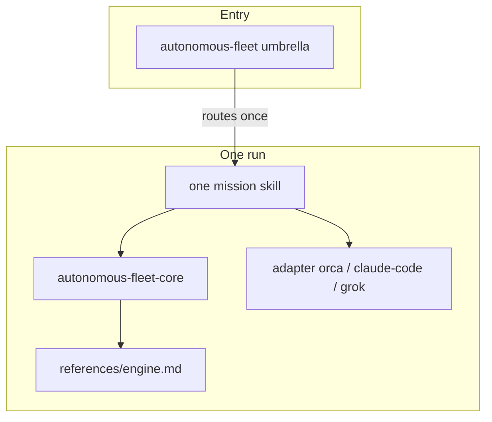

# Research: Skill composition, optional skills, and multi-mission orchestration

**Date:** 2026-06-20  
**Scope:** How autonomous-fleet composes agentskills.io skills today; gaps for optional/external skills, parallel missions, and conditional mission chains; recommendations aligned with the agentskills spec and progressive disclosure.

---

## Executive summary

| Question | Today | Recommendation |
|----------|-------|----------------|
| **What loads on a run?** | `autonomous-fleet-core` + one adapter + one mission (umbrella routes, then exits) | Keep the 3-layer model; standardize `## Required skills` on every mission |
| **Other skills inside a mission?** | Implicit deferrals + one hard gate (`design-integration` MCP); no optional-skill contract | Add `## Optional skills` with activation triggers and token budget notes |
| **Parallel missions (same repo)?** | Not supported — one BASE, one ledger, one coordinator | Stay sequential per repo; use `fleet-program` for ordered chains |
| **Parallel work inside a mission?** | Supported via `PLACE(independent)` + hot-file rule | Document in adapter template; Orca can express deps natively |
| **Conditional / multi-mission flows?** | Umbrella picks one mission; missions have internal gates (T3 after T1+T2) | Add `fleet-program` meta-skill for explicit DAGs and handoffs |

The framework is already well aligned with agentskills.io **progressive disclosure** (catalog → SKILL.md → `references/`). The main gap is **cross-mission orchestration** and a **consistent composition contract** across all 12 missions.

---

## 1. agentskills.io model (external baseline)

From the [specification](https://agentskills.io/specification) and [client implementation guide](https://agentskills.io/client-implementation/adding-skills-support):

### Progressive disclosure (three tiers)

| Tier | Content | When loaded | Cost |
|------|---------|-------------|------|
| 1 | `name` + `description` | Session start (catalog) | ~50–100 tokens/skill |
| 2 | Full `SKILL.md` body | On activation | &lt;5k tokens recommended |
| 3 | `scripts/`, `references/`, `assets/` | When instructions say to read them | Variable |

### Composition implications

- **Multiple skills per task are normal.** The model activates skills by description match or explicit user request; there is no spec-level “only one skill” rule.
- **Coherent units.** Best practices say a skill should encapsulate one composable unit — not too narrow (many loads) nor too broad (hard to trigger, noisy context).
- **Defaults, not menus.** Pick a default path; mention alternatives briefly.
- **Subagent delegation (optional client feature).** Some hosts run a skill in an isolated sub-session and return a summary — autonomous-fleet adapters already map this to `SPAWN_WORKER` / Task tool.

### Cross-client install layout

`npx skills` and `.agents/skills/` are the interoperability surface. autonomous-fleet publishes **21** skills under `skills/*/` (umbrella, program, setup, core, 5 adapters, 12 missions); installs copy into `.agents/skills/`. Project skills can shadow user skills (project wins).

**Takeaway for fleet:** Required stack (core + adapter + mission) fits tier-2 activation. `references/engine.md` is correct tier-3 usage. Optional third-party skills should be tier-2 **only when triggered**, with explicit “read when …” lines to avoid catalog bloat.

---

## 2. Current autonomous-fleet composition

### Layer diagram



### What each layer owns

| Layer | Skill(s) | Responsibility |
|-------|----------|----------------|
| Umbrella | `autonomous-fleet` | Intent → mission; install hints; no execution loop |
| Engine | `autonomous-fleet-core` | Primitives, ledger discipline, placement, PR pipeline, autonomy enforcement |
| Engine (tier 3) | `references/engine.md` | Full method (~200 lines) — loaded when core activates |
| Adapter | `autonomous-fleet-adapter-*` | Maps primitives to runtime (Orca CLI, Task/subagents, etc.) |
| Mission | `doc-sync`, `bug-batch`, … | Goal, roles, ledger filename, task DAG **within** mission, done condition |

**Invariant today:** one coordinator session, one `BASE` branch, one mission ledger under `docs/`, one final readiness doc.

### Within-mission parallelism (supported)

The core engine defines:

- `PLACE(independent)` — isolated worktree/branch for parallel PRs
- `PLACE(dependent)` — same checkout, fresh worker
- **Hot-file rule:** parallelize non-overlapping files; serialize same-file edits until prior PR merges

Missions that use this explicitly: `doc-sync`, `test-coverage`, `bug-batch`, `legacy-rebuild`, `design-integration`, `take-product-to-completion`, etc.

Orca adapter additionally exposes `task-create --deps` for native task graphs inside one orchestration run.

### Within-mission conditionals (supported)

Examples already in mission skills:

| Pattern | Example |
|---------|---------|
| **Freeze-then-fix** | `doc-sync` T-AUDIT → DRIFT INDEX frozen → T-FIX loop |
| **Gated control point** | `take-product-to-completion` T3 after T1+T2; boundary FROZEN |
| **Hard external dependency** | `design-integration` — MCP `/design-login`; only allowed user pause |
| **Defer out of scope** | `doc-sync` code bugs → DECISIONS.md, not fixed here |
| **Defer to another mission** | `cleanup` → `legacy-rebuild`; `dependency-update` → major bumps → `targeted-migration` |

These are **intra-mission** state machines backed by file ledgers, not cross-mission orchestration.

---

## 3. Other skills inside missions (gap analysis)

### Required skills — inconsistent

Only `doc-sync` has an explicit section:

```markdown
## Required skills
1. autonomous-fleet-core
2. One runtime adapter: ...
```

Other missions say “Apply autonomous-fleet-core …” in prose. The umbrella `references/missions.md` notes the pattern but only one mission implements it.

### Optional / external skills — undocumented contract

| Mission | External capability | How it's specified today |
|---------|---------------------|---------------------------|
| `design-integration` | `claude_design` MCP | HARD EXTERNAL DEPENDENCY block |
| `doc-sync` | — | Defers code fixes to other missions |
| `test-coverage` | — | Defers logic changes |
| `cleanup` | knip, ts-prune, etc. | “use repo tooling where available” (not skills) |
| All | `skill-creator`, `qa`, `ship`, etc. | Not mentioned — agent may auto-load from user catalog |

**Risk:** An agent with 50+ user skills may activate unrelated skills (token noise, conflicting instructions). agentskills best practices: *“Would the agent get this wrong without this instruction?”* — fleet should say when **not** to load extras.

### Deferral graph (implicit, cross-mission)

Edges observed in mission text and readiness docs:

```
doc-sync ──finding──► bug-batch / test-coverage
test-coverage ──finding──► (logic change missions)
cleanup ──scope creep──► legacy-rebuild
dependency-update ──major migration──► targeted-migration
take-product-to-completion ──ROADMAP──► (future runs, any mission)
```

There is no machine-readable `deferred-missions` block in readiness templates — only prose in `doc-sync-readiness.md` style sections.

---

## 4. Parallel missions

### Same repository — **not supported** (by design)

Conflicts if two missions ran concurrently on one repo:

| Shared resource | Collision |
|-----------------|-----------|
| `BASE` branch | Two integration branches or merge races |
| `docs/*-progress.md` | Ledger corruption |
| `DECISIONS.md` | Concurrent writes |
| Hot files | Same as within-mission, but **across** missions |
| Coordinator | Two loops both calling `WAIT` / subagents |

**Verdict:** Keep **one active fleet run per repo**. Queue additional missions sequentially (or after BASE→main promotion).

### Different repositories — **fine**

Each repo gets its own REPO_ROOT, BASE, ledger, and coordinator. No fleet-level global state.

### Parallel **tasks** vs parallel **missions**

| | Parallel tasks (same mission) | Parallel missions (same repo) |
|--|-------------------------------|-------------------------------|
| Placement | `independent` worktrees | Would need separate BASE + ledger each |
| File rule | Hot-file serialization | Would need cross-mission file ownership map |
| Merge target | Same BASE | Competing PR streams to same BASE |
| Status | Implemented | Not implemented |

### Orca note

Orca can run multi-task graphs with `--deps` **inside one mission run**. That is not the same as running `doc-sync` and `test-coverage` simultaneously on one repo — unless a future `fleet-program` mission defines a **single** ledger and unified ownership map for the combined program.

---

## 5. Conditional and multi-mission orchestration

### What exists: umbrella routing (single shot)

`autonomous-fleet` maps intent → **one** mission, then the umbrella’s job is done. It does not:

- Run mission A then B based on findings
- Branch on coverage % or audit severity
- Maintain a program-level ledger

### What exists: mission-internal DAGs

Rich examples:

- `legacy-rebuild`: T-FLOOR ∥ T-RESEARCH → T-PLAN (frozen) → parallel units
- `adversarial-review-and-fix`: audit → frozen findings → fix loop with severity ordering
- `take-product-to-completion`: T1 ∥ T2 → T3 (boundary) → T4/T5 parallel if non-overlapping → T6…n

These are **the right pattern for complexity that shares one BASE and one semantic goal.**

### What’s missing: cross-mission programs

User intents that span missions:

| User intent | Natural chain |
|-------------|---------------|
| “Make this repo healthy” | `doc-sync` → `test-coverage` → `cleanup` |
| “Ship this stalled app” | `take-product-to-completion` (may internally need landing page work) |
| “Docs wrong + no tests” | `doc-sync` → `test-coverage` (sequential; second BASE off first’s merge) |
| “Audit then fix” | `adversarial-review-and-fix` (already combined) |

Today the user or coordinator must **manually** start a second run. Readiness docs mention deferrals but do not enqueue the next mission.

---

## 6. Industry patterns (secondary)

The [multi-agent-orchestration](https://github.com/qodex-ai/ai-agent-skills/blob/main/skills/multi-agent-orchestration/SKILL.md) community skill catalogs patterns fleet already uses piecemeal:

| Pattern | Fleet equivalent |
|---------|------------------|
| Sequential chain | Mission task loops; **not** cross-mission |
| Parallel execution | `PLACE(independent)` + subagents |
| Hierarchical | Coordinator + role pipeline (@claude / @grok / @codex) |
| Gated control points | Frozen INDEX / boundary artifacts |
| Tool-mediated state | File ledgers + `DECISIONS.md` |

Frameworks (CrewAI, LangGraph) use explicit graphs and shared state objects. Fleet deliberately uses **files** as external brain for context survival — a strength to preserve in any `fleet-program` design.

---

## 7. Token and context budget

Approximate tier-2 load for a typical Grok run:

| Skill | Approx. size |
|-------|----------------|
| `autonomous-fleet-core` | SKILL.md + engine.md on demand |
| Adapter (e.g. grok) | ~120 lines |
| Mission (e.g. doc-sync) | ~80 lines |
| Umbrella | Only if user started vague — can skip if mission explicit |

Adding optional skills (e.g. `skill-creator`, `qa`) can add 2–5k+ tokens each. Recommendations:

1. **Required block** — always these three layers.
2. **Optional block** — max 1–2 skills, with “activate only if …” triggers.
3. **Never** load a second mission skill alongside the active mission (conflicting ledgers/goals).

---

## 8. Recommendations (prioritized)

### P0 — Low effort, high clarity (no new skills)

1. **Standardize `## Required skills`** on all 12 missions (match `doc-sync` template).
2. **Add `## Optional skills`** template to mission authoring guide (`autonomous-fleet-adapter-template` or core `references/composition.md`):

   ```markdown
   ## Optional skills
   Activate only when the trigger applies. Do not load unrelated catalog skills.

   | Skill | Trigger | Default if unavailable |
   |-------|---------|------------------------|
   | `skill-creator` | Validating/editing fleet skills in this repo | Skip; use scripts/validate-skills.sh |
   ```

3. **Readiness doc section:** `## Recommended next missions` — structured list parsed from deferrals (mission id, reason, blocker).

### P1 — `fleet-program` meta-skill (new skill)

A fourth **optional** entry skill (like umbrella, not a mission):

- **Input:** ordered or conditional list of missions + stop conditions
- **Ledger:** `docs/fleet-program-progress.md` (program phase, per-mission status, handoff notes)
- **Rules:**
  - One mission active at a time
  - Each mission completes DONE + readiness before next starts
  - Next mission’s BASE = previous mission’s BASE after final merge (or default branch if promoted)
  - Carry forward `DECISIONS.md` deferral sections into next mission’s T-AUDIT/T-MAP

Example program spec (YAML in ledger or user message):

```yaml
program: repo-health
missions:
  - id: doc-sync
    on_success: continue
  - id: test-coverage
    when: always
  - id: cleanup
    when: deferrals_from_previous.empty  # optional conditional
```

### P2 — Core reference: `references/composition.md`

Short tier-3 doc linked from core SKILL.md:

- One run = core + adapter + one mission
- No parallel missions per repo
- Hot-file rule applies across sequential missions in a program (carry ownership map forward)
- Optional skills policy

### P3 — Orca adapter enhancement

Document mapping `fleet-program` steps to `orca orchestration task-create --deps` when the whole program runs under Orca (single native graph, still one mission skill at a time at the fleet semantic layer).

### Explicit non-goals

- **Parallel missions on one repo** — cost/complexity outweigh benefit; hot-file + ledger contention
- **Umbrella executing multiple missions** — keep umbrella a router; program skill owns chains
- **Bundling third-party skills in fleet repo** — stay publishable via `npx skills add`; optional skills are references only

---

## 9. Proposed mission template (composition sections)

```markdown
## Required skills

1. `autonomous-fleet-core` — read `references/engine.md` when coordinating
2. One runtime adapter: `autonomous-fleet-adapter-{orca,claude-code,grok}`

## Optional skills

| Skill | Activate when | If unavailable |
|-------|---------------|----------------|
| _(mission-specific)_ | _(trigger)_ | _(fallback)_ |

## Deferred missions

Record in readiness doc and DECISIONS.md; do not start another mission in the same run.

| Finding type | Route to |
|--------------|----------|
| _(mission-specific)_ | `other-mission` |
```

---

## 10. Decision record (for DECISIONS.md on future work)

| ID | Decision | Rationale |
|----|----------|-----------|
| C-01 | Keep 3-layer required stack | Matches agentskills coherent-unit guidance; exercised in doc-sync dogfood (loads + validators pass) |
| C-02 | No concurrent missions per repo | Single BASE/ledger/coordinator; avoids merge thrash |
| C-03 | Cross-mission via `fleet-program`, not umbrella | Umbrella stays lightweight router; program owns sequential state |
| C-04 | Optional skills are opt-in with triggers | Controls token budget and instruction conflicts |
| C-05 | File ledgers remain source of truth | Aligns with context handoff and agentskills “validation loops” |

---

## 11. Implementation status (2026-06-20 follow-up)

| Recommendation | Status |
|----------------|--------|
| `## Required / Optional / Deferred` on missions | Shipped |
| `fleet-program` sequential chains | Shipped |
| `## Worker skills` + DISPATCH injection | Shipped (engine + adapters + missions) |
| `fleet-outcome` YAML on readiness docs | Shipped (`references/fleet-outcome.md`) |
| Conditional campaign DAGs | Shipped (`fleet-program/references/campaigns.md`) |
| Parallel same-repo missions | Explicitly not built |
| CI (`validate-all.sh`) | Shipped (`.github/workflows/ci.yml`) |
| `skills-lock.json` (19 fleet skills) | Refreshed |
| Stale `doc-sync-audit.md` | Annotated superseded |
| Community skills mix-and-match | Shipped (`docs/research-community-skills.md`, `references/community-skills.md`) |
| Campaign presets `ship-with-proof`, `align-then-ship`, `quality-gate` | Shipped (`scripts/campaigns/`, `campaigns.md`) |
| Community mission Optional/Worker tables | Shipped (design-integration, landing-page-convergence, adversarial-review-and-fix) |
| Coordinator behaviors in engine.md | Shipped |
| `setup-autonomous-fleet` | Shipped |
| External dogfood ship-with-proof pack | Partial — one interactive (non-headless) dogfood on a fork clone; not upstreamed; headless run pending grok auth (`docs/external-dogfood/ship-with-proof-evidence.md`) |

---

## 12. References

- [agentskills.io specification](https://agentskills.io/specification)
- [Best practices for skill creators](https://agentskills.io/skill-creation/best-practices)
- [Adding skills support to your agent](https://agentskills.io/client-implementation/adding-skills-support)
- autonomous-fleet: `skills/autonomous-fleet-core/references/engine.md`
- autonomous-fleet: `skills/autonomous-fleet/references/missions.md`
- Dogfood evidence: `docs/doc-sync-readiness.md` (deferrals section)
- Community skills: `docs/research-community-skills.md`, `skills/autonomous-fleet-core/references/community-skills.md`

---

## Appendix: Mission ↔ deferral quick reference

| Mission | Defers to |
|---------|-----------|
| `doc-sync` | Code bugs → `bug-batch` / related |
| `test-coverage` | Logic changes → fix/migration missions |
| `cleanup` | Re-architecture → `legacy-rebuild` |
| `dependency-update` | Large majors → `targeted-migration` |
| `take-product-to-completion` | ROADMAP items → future mission (user choice) |
| `design-integration` | — (MCP gate only) |