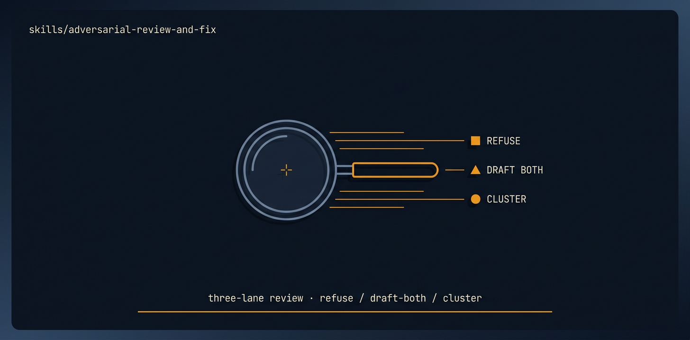

# adversarial-review-and-fix

<p align="center">
  
</p>

> [Tier 2 · moderate autonomy · full review gate · the proven two-phase workhorse] Run a rigorous CODE-GROUNDED adversarial architecture review of a repo, FREEZE it as the source of truth, then close every confirmed finding one at a time until done.

🟧 **Tier 3 · Mission** — a discrete engineering job, safe to compose

# Full description

[Tier 2 · moderate autonomy · full review gate · the proven two-phase workhorse] Run a rigorous CODE-GROUNDED adversarial architecture review of a repo, FREEZE it as the source of truth, then close every confirmed finding one at a time until done. Use for a security/architecture/ reliability hardening pass, a pre-production audit-and-remediate, or "review the whole app and fix everything." Phase 0 reviews the actual source (not existing docs) and a skeptic narrows out false findings; Phase 1 fixes the confirmed set with full safety rails. Runs via the autonomous-fleet-core engine. Trigger on: "adversarial review and fix", "audit and remediate", "review the whole app and fix the issues", "harden this before production", "find and fix the architecture problems".

# Source of truth

🟢 **[`SKILL.md`](./SKILL.md)** — agent-facing spec. Anything agents need (process, references, scripts, validation gates) lives there.

This README is a thin human-facing surface. Skill behavior is governed entirely by `SKILL.md` and its references/.

# Quick install

```bash
npx skills add https://github.com/ravidsrk/autonomous-fleet \
  --skill adversarial-review-and-fix -y
```

Then activate in your agent (e.g. Claude Code, Cursor, Grok, Codex, or Mogra) and reference by name.

# See also

- [autonomous-fleet README](../../README.md) — full framework overview
- [AGENTS.md](../../AGENTS.md) — repo conventions for AI coding agents
