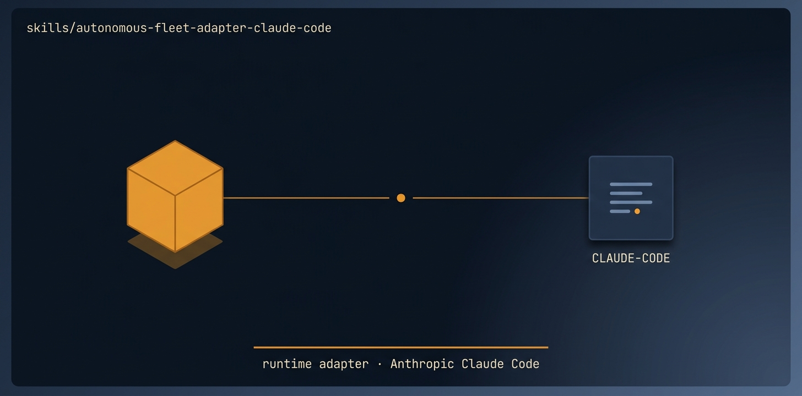

# autonomous-fleet-adapter-claude-code

<p align="center">
  
</p>

> The CLAUDE CODE adapter for autonomous-fleet-core.

🟪 **Tier 2 · Adapter** — runtime bridge to one specific agent runtime

# Full description

The CLAUDE CODE adapter for autonomous-fleet-core. Maps each engine PRIMITIVE to Claude Code's native mechanics — subagents via the Task tool, git worktrees for isolation, the Bash tool for git/gh, and TodoWrite as the live task mirror. Load this alongside autonomous-fleet-core when running a mission in Claude Code instead of Orca. Because Claude Code has no separate orchestration runtime, the coordinator IS the main Claude Code session and workers are subagents or worktree-scoped sub-sessions; the file ledger is the durable source of truth and TodoWrite mirrors it.

# Source of truth

🟢 **[`SKILL.md`](./SKILL.md)** — agent-facing spec. Anything agents need (process, references, scripts, validation gates) lives there.

This README is a thin human-facing surface. Skill behavior is governed entirely by `SKILL.md` and its references/.

# Quick install

```bash
npx skills add https://github.com/ravidsrk/autonomous-fleet \
  --skill autonomous-fleet-adapter-claude-code -y
```

Then activate in your agent (e.g. Claude Code, Cursor, Grok, Codex, or Mogra) and reference by name.

# See also

- [autonomous-fleet README](../../README.md) — full framework overview
- [AGENTS.md](../../AGENTS.md) — repo conventions for AI coding agents
