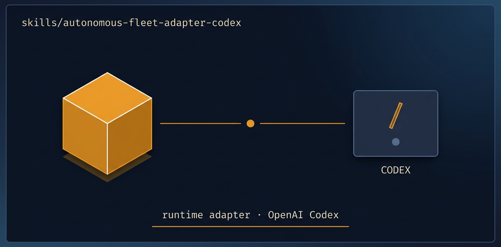

<!-- title: autonomous-fleet-adapter-codex | description: The Codex runtime adapter, mapping every engine primitive to OpenAI Codex mechanics. | sidebar_order: 9 -->

# autonomous-fleet-adapter-codex

<p align="center">
  
</p>

> The Codex adapter for autonomous-fleet-core. It maps each engine primitive to OpenAI Codex
> mechanics: subagents, git worktrees, shell for git and gh, and the file ledger as durable truth.
> Load it alongside autonomous-fleet-core when you run a mission in Codex (app, IDE, or CLI). The
> coordinator IS the main Codex thread, workers are subagents or worktree-scoped sessions, and the
> file ledger survives compaction.

🟧 **Tier 2 · Adapter** — the runtime bridge that teaches the engine how to speak Codex.

**On this page:** [When to use it](#when-to-use-it) · [What it produces](#what-it-produces) ·
[What it expects](#what-it-expects-from-your-repo) ·
[Common failure modes](#common-failure-modes) · [Quick install](#quick-install) ·
[Learn more](#learn-more)

## When to use it

- You run autonomous-fleet missions inside OpenAI Codex (app, IDE extension, or the `codex` CLI).
- You want workers placed as Codex subagents for self-contained units, or as worktree-scoped shell
  sessions when a unit needs its own branch and PR.
- You are driving an interactive Codex thread and want `/goal` continuation (pair with `/plan` when
  scope is ambiguous).
- You want optional container-use placement (isolated container plus branch plus sandbox) when
  Docker is available.

## What it produces

This adapter ships no artifacts of its own. It loads with autonomous-fleet-core, and the running
mission produces the run-archive under `.fleet/runs/<id>/`, the `docs/<mission>-progress.md` file
ledger (the durable source of truth across turns), and one PR per unit via `gh pr create`. Merges
use `gh pr merge --merge`, never squash. See [Guide 13](../../docs/guide/13-extending.md) for the
primitive-by-primitive mapping.

## What it expects from your repo

- A git repo with a resolvable `REPO_ROOT` and git worktree support.
- `gh auth status` passing in your shell (otherwise the adapter falls back to local merge-commits
  into BASE).
- A BASE branch (created off the default branch at current HEAD if absent).
- Codex with goals enabled for `SET_GOAL`: run `codex features enable goals`, or set
  `features.goals = true` in `config.toml`.
- Optional: the container-use MCP (`codex mcp add container-use -- container-use stdio`, needs
  Docker) for sandboxed container placement.

## Common failure modes

- `/goal` missing in the composer: goals are not enabled. See the setup steps in
  [Guide 02](../../docs/guide/02-installation.md).
- `/goal ...` passed to `codex exec` does nothing: exec is single-shot and does not interpret slash
  commands. Headless continuation needs an external loop, and that headless path is not yet fully
  validated end-to-end. The interactive thread is the supported flow today.
- A worker returns without writing the ledger: re-read its summary and relaunch (the work is
  idempotent).
- Context pressure mid-run: the coordinator writes a CONTEXT HANDOFF block in the ledger so a fresh
  thread can resume.

## Quick install

```bash
npx skills add https://github.com/ravidsrk/autonomous-fleet \
  --skill autonomous-fleet-adapter-codex -y
```

Then load it alongside `autonomous-fleet-core` in your Codex session and reference it by name.

## Learn more

- [Guide 02 — Installation](../../docs/guide/02-installation.md) — picking and setting up the Codex runtime
- [Guide 13 — Extending](../../docs/guide/13-extending.md) — the primitive-by-primitive adapter mapping
- [SKILL.md](./SKILL.md) — the agent-facing spec that governs this adapter's behavior

---

[📖 Guide Index](README.md)
