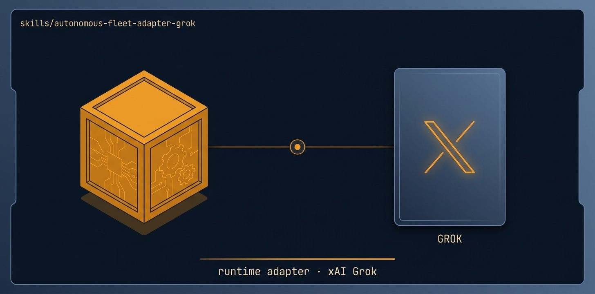

# autonomous-fleet-adapter-grok

<p align="center">
  
</p>

> The GROK adapter for autonomous-fleet-core.

🟪 **Tier 2 · Adapter** — runtime bridge to one specific agent runtime

# Full description

The GROK adapter for autonomous-fleet-core. Maps each engine PRIMITIVE to Grok Build mechanics — subagents via the Task tool, git worktrees for isolation, the Shell tool for git/gh, and the file ledger as the durable source of truth. Load this alongside autonomous-fleet-core when running a mission in Grok instead of Orca. Because Grok has no separate orchestration daemon, the coordinator IS the main Grok session and workers are subagents (Task tool) or worktree-scoped shell-driven sessions; the file ledger is the authority.

# Source of truth

🟢 **[`SKILL.md`](./SKILL.md)** — agent-facing spec. Anything agents need (process, references, scripts, validation gates) lives there.

This README is a thin human-facing surface. Skill behavior is governed entirely by `SKILL.md` and its references/.

# Quick install

```bash
npx skills add https://github.com/ravidsrk/autonomous-fleet \
  --skill autonomous-fleet-adapter-grok -y
```

Then activate in your agent (e.g. Claude Code, Cursor, Grok, Codex, or Mogra) and reference by name.

# See also

- [autonomous-fleet README](../../README.md) — full framework overview
- [AGENTS.md](../../AGENTS.md) — repo conventions for AI coding agents
