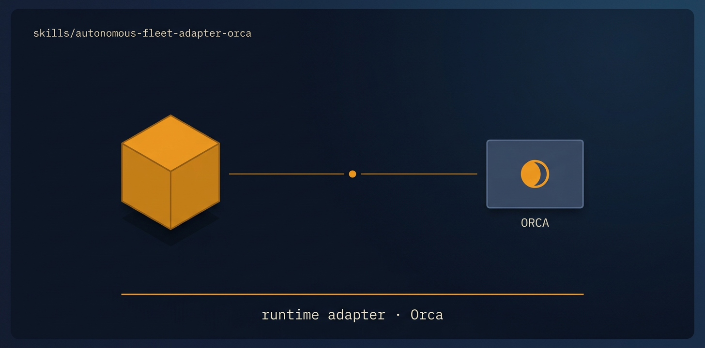

<!-- title: autonomous-fleet-adapter-orca | description: The Orca runtime adapter for autonomous-fleet-core, mapping each engine primitive to Orca orchestration CLI commands. | sidebar_order: 11 -->

# autonomous-fleet-adapter-orca

<p align="center">
  
</p>

> The Orca adapter for autonomous-fleet-core. It maps each engine primitive (spawn worker,
> dispatch, wait, inspect, place, worker_done/ask/reply, open/merge PR, sync task state) onto the
> real Orca orchestration CLI. Load it alongside autonomous-fleet-core when you run a mission on
> Orca.

🟦 **Tier 2 · Adapter**, the runtime bridge that turns engine primitives into Orca CLI calls.

**On this page:** [When to use it](#when-to-use-it) · [What it produces](#what-it-produces) ·
[What it expects from your repo](#what-it-expects-from-your-repo) ·
[Common failure modes](#common-failure-modes) · [Quick install](#quick-install) ·
[Learn more](#learn-more)

## When to use it

- You are running an autonomous-fleet mission on the [Orca](https://www.onorca.dev) runtime and
  want each worker in its own worktree and terminal.
- You need parallel, independent PRs: the adapter places `independent` work in a fresh worktree on
  its own branch off BASE, `dependent` work in the active worktree on a fresh terminal.
- You want cross-vendor blind-spot diversity by default: `@codex` builds, a fresh build-blind
  `@claude` reviews, `@claude` integrates (`@grok` builds design missions), overridable by the
  mission's role pipeline.
- You are scripting against Orca's `orchestration` subcommands and want a version-tolerant mapping
  that tries one syntax and falls back rather than hard-failing.

## What it produces

- Orca worktrees and terminals per worker, plus `orchestration` tasks created with
  `task-create` and dispatched with `dispatch --inject`.
- A file ledger that stays the source of truth, kept aligned with Orca task state via
  `task-update --status <ready|dispatched|completed|failed|blocked>` on every lifecycle change.
- One merge-commit PR per unit (`gh pr merge <n> --merge --delete-branch`, never `--squash`),
  with the merged worktree archived or removed on cleanup.
- Runtime-goal bookkeeping in the ledger only: Orca has no `/goal` API, so SET_GOAL, UPDATE_GOAL,
  GOAL_COMPLETE, and GOAL_BLOCKED map to `## Runtime goal` / `LAST_UPDATE` / `PHASE: DONE` and an
  `escalation` message, with the coordinator's `check --wait` loop acting as the enforcement harness.

## What it expects from your repo

- The Orca orchestration CLI, `git`, and `gh` installed. Orca's orchestration experimental flag must
  be on, and `orca status --json` must report a running runtime.
- `gh auth status` to open PRs (without it the adapter falls back to local merge-commits into BASE).
- A BASE branch: if absent, the adapter creates it off the default branch at the current HEAD.
- `gitleaks` available for the precondition checks the core calls for.

## Common failure modes

- Dispatching before a terminal reaches `tui-idle`: an inject on a non-idle terminal is lost. Wait
  on `terminal wait --for tui-idle` first. See [Troubleshooting](../../docs/guide/14-troubleshooting.md).
- A worker looks done but sent no `worker_done`: confirm the completion instruction was injected
  with `dispatch-show --task <id> --preamble --json`, then re-send via `terminal send`, never kill a
  live worker. See [Troubleshooting](../../docs/guide/14-troubleshooting.md).
- Running `orchestration reset` mid-run, or treating Orca's 3-consecutive-failure circuit break as a
  stop: it is a reassign signal. See [Troubleshooting](../../docs/guide/14-troubleshooting.md).
- An older CLI rejecting `--agent` on `worktree create`: create the worktree first, then
  `terminal create --command "<cli>"`. See [Troubleshooting](../../docs/guide/14-troubleshooting.md).
- Addressing dispatch lifecycle messages to a group handle (`@all`, `@idle`, `@claude`): those are
  broadcast-only. Target the concrete coordinator handle. See [Troubleshooting](../../docs/guide/14-troubleshooting.md).

> Two current limitations to know up front. The trace stream emits only the `T-FINAL` event in
> production today; per-transition emission is still rolling out. And headless campaign mode
> (`run-campaign.sh`) accepts only the `grok`, `claude`, and `codex` CLIs, so interactive Orca
> orchestration is the supported path for Orca missions.

## Quick install

```bash
npx skills add https://github.com/ravidsrk/autonomous-fleet \
  --skill autonomous-fleet-adapter-orca -y
```

Then load it alongside `autonomous-fleet-core` and run a mission on Orca.

## Learn more

- [Guide 02, Installation](../../docs/guide/02-installation.md), setting up the Orca runtime
- [Guide 13, Extending](../../docs/guide/13-extending.md), the adapter primitive table, end to end
- [SKILL.md](./SKILL.md), the agent-facing spec

← [Guide Index](../../docs/guide/README.md)
