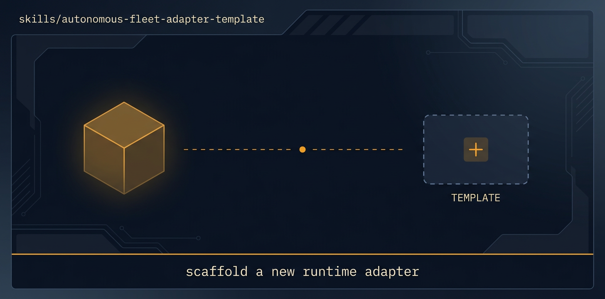

<!-- title: autonomous-fleet-adapter-template | description: Template for porting autonomous-fleet to a new runtime by mapping every PRIMITIVE the core calls. | sidebar_order: 12 -->

# autonomous-fleet-adapter-template

<p align="center">
  
</p>

> TEMPLATE for writing a new autonomous-fleet adapter (codex, gemini-cli, a custom CLI fleet, or a
> raw tmux+worktrees setup). Copy it, rename to autonomous-fleet-adapter-YOUR-TOOL, and fill in how
> YOUR runtime implements each PRIMITIVE the core calls. The missions and the core never change,
> only this mapping does. Not a runnable mission skill.

🟦 **Tier 2 · Adapter**, the starting point for adding a new runtime to autonomous-fleet.

**On this page:** [When to use it](#when-to-use-it) · [What it produces](#what-it-produces) ·
[What it expects from your repo](#what-it-expects-from-your-repo) ·
[Common failure modes](#common-failure-modes) · [Quick install](#quick-install) ·
[Learn more](#learn-more)

## When to use it

- You want to run the existing mission library on a runtime that has no adapter yet (Gemini CLI, a
  bespoke CLI fleet, a raw tmux + git-worktrees loop).
- You are adding a runtime whose concurrency model differs from the shipped ones and you need to
  declare it: a persistent orchestration daemon (like Orca) versus a coordinator that is itself a
  session (like Claude Code).
- You need a checklist of every PRIMITIVE the core calls, so nothing is left unmapped.
- You are authoring a new mission skill and want the required `SKILL.md` section contract.

This is a reference template, not a runnable mission. It does no work on its own.

## What it produces

Nothing at runtime. Copying it produces a new adapter skill: `skills/autonomous-fleet-adapter-<tool>/`
with frontmatter `name` matching the directory, a `branch prefix` default, a stated CONCURRENCY
MODEL, and a filled PRIMITIVE → `<TOOL>` mapping (PLACE, SPAWN_WORKER, DISPATCH, WAIT, INSPECT,
WORKER_DONE / ASK / REPLY, OPEN_PR / MERGE_PR / CLEANUP, SYNC_TASK_STATE, and the goal-mode
primitives if your host supports them). Once filled, any mission runs by loading the core plus your
adapter.

## What it expects from your repo

- A runtime with isolated checkouts (git worktrees or equivalent) and shell access to `gh` for PRs.
- The ability to state real start-up PRECONDITIONS: runtime reachable, auth, worktree support,
  gitleaks, BASE branch exists.
- A ROLE → AGENT CLI mapping that honours the cross-vendor rule. With only one vendor available,
  keep terminal separation (a fresh build-blind reviewer session) and record single-vendor mode.

## Common failure modes

- Leaving a PRIMITIVE bullet unfilled or weakening a non-negotiable (squash-merging, skipping the
  conflict-aware merge, dropping checkout cleanup). See [Troubleshooting](../../docs/guide/14-troubleshooting.md).
- Forgetting to prepend the mission `## Worker skills` block into every DISPATCH payload, so workers
  never learn the completion contract. See [The engine](../../docs/guide/06-the-engine.md).
- Authoring a second mission loader. Chains and conditional DAGs belong in `fleet-program`, not here.

## Quick install

```bash
npx skills add https://github.com/ravidsrk/autonomous-fleet \
  --skill autonomous-fleet-adapter-template -y
```

Then activate in your agent (Claude Code, Cursor, Grok, Codex, or Orca) and reference it by name.

## Learn more

- [Guide 13, Extending](../../docs/guide/13-extending.md), adding an adapter, primitive by primitive.
- [Guide 02, Installation](../../docs/guide/02-installation.md), where adapters fit at install time.
- [SKILL.md](./SKILL.md), the agent-facing spec and the full PRIMITIVE mapping skeleton.

---

[📖 Guide Index](../../docs/guide/README.md)
