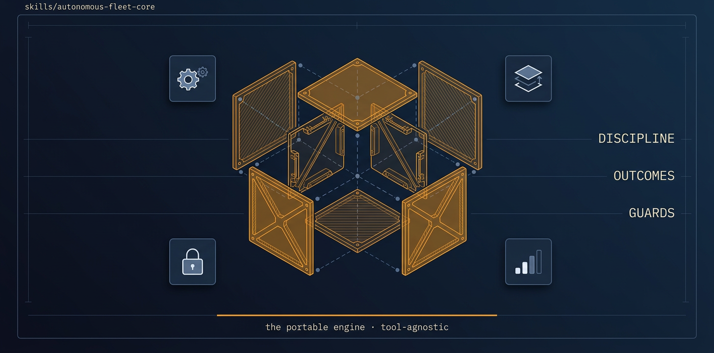

<!-- title: autonomous-fleet-core | description: The portable, tool-agnostic engine missions load to run fully-autonomous multi-agent jobs. | sidebar_order: 2 -->

# autonomous-fleet-core

<p align="center">
  
</p>

> The portable, tool-agnostic engine for running fully-autonomous multi-agent engineering jobs. It
> holds everything that does NOT depend on the orchestration tool: self-orientation, the
> fully-autonomous coordinator loop with file-ledger boolean gates, context-handoff to survive
> compaction, the worker-placement decision logic (dependent vs independent), the PR-per-task
> pipeline (commits preserved, conflict-aware merge, worktree cleanup), the empirical risk tiers,
> safety rails, secret hygiene, and commit/authorship policy. It speaks in primitives; the active
> adapter maps each primitive to its tool's real commands.

🟦 **Tier 1 · Engine** — loaded automatically by missions; do not run it alone.

**On this page:** [When to use it](#when-to-use-it) · [What it produces](#what-it-produces) ·
[What it expects](#what-it-expects-from-your-repo) · [Failure modes](#common-failure-modes) ·
[Quick install](#quick-install) · [Learn more](#learn-more)

## When to use it

You almost never load this skill by hand. It is the engine a mission loads for you.

- A mission skill (`doc-sync`, `test-coverage`, `adversarial-review-and-fix`) needs the coordinator
  loop, ledger gates, and PR pipeline. It loads core plus exactly one adapter.
- You are chaining missions with `fleet-program`. Each node loads core under the hood.
- You are writing a new mission or adapter and need the primitive contract every runtime implements.

## What it produces

Core does not produce artifacts on its own. Driven by a mission, it leaves a manifest-audited trail
under `.fleet/runs/<run_id>/` (run_id format `YYYYMMDDTHHMMSSZ-<mission>-<6-hex>`):

- `manifest.json` — the audit trail; a `status: done` outcome is rejected if it does not validate.
- One PR per task, commits preserved, merged conflict-aware, with worktrees cleaned up after.
- A `T-FINAL` trace event, emitted BEFORE the manifest write per the trace-first doctrine.

## What it expects from your repo

- `git` and the `gh` CLI available in the target repository.
- A mission skill AND one runtime adapter (`orca`, `claude-code`, `grok`, or `codex`) loaded with
  it. Core refuses to be the whole story: it has no runtime mechanics of its own.

## Common failure modes

- Loaded alone, with no mission and no adapter: nothing dispatches. See Guide 06 and Troubleshooting.
- A primitive (`PLACE`, `SPAWN_WORKER`, `DISPATCH`, `WAIT`, `OPEN_PR`, ...) the adapter never maps.
- A freeform run-id or a missing archive that fails manifest validation at terminate time.
- Headless campaign mode (`run-campaign.sh`) is not yet fully validated end-to-end; the interactive
  chat / `/goal` path is the supported flow today.

## Quick install

```bash
npx skills add https://github.com/ravidsrk/autonomous-fleet \
  --skill autonomous-fleet-core -y
```

You will normally get core pulled in automatically when you install a mission. Activate it in your
agent (Claude Code, Cursor, Grok, Codex, or Orca) and reference it by name.

## Learn more

- [Guide 06 — The engine](../../docs/guide/06-the-engine.md) — primitives, the ledger, the frozen DAG
- [SKILL.md](./SKILL.md) — the agent-facing spec

---

[📖 Guide Index](../../docs/guide/README.md)
