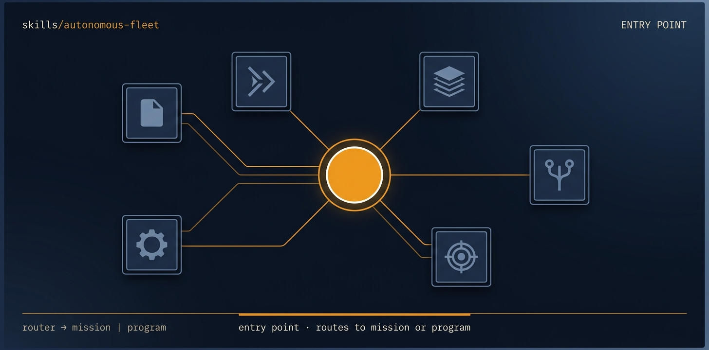

<!-- title: autonomous-fleet | description: Umbrella skill that routes a vague request to the right mission, loads the engine plus an adapter, and runs unattended. | sidebar_order: 1 -->

# autonomous-fleet

<p align="center">
  
</p>

> Entry point for the autonomous-fleet multi-agent engineering framework. Use it whenever you
> want fully-autonomous coding runs, multi-agent orchestration, or PR-per-task pipelines but
> have not yet named a specific mission. It reads your intent, routes to one mission (or to
> fleet-program for a chain), loads autonomous-fleet-core plus a runtime adapter, and runs
> unattended on the current repo.

🟦 **Tier 1 · Umbrella**, routes vague requests to the right mission.

**On this page:** [When to use it](#when-to-use-it) · [What it produces](#what-it-produces) ·
[What it expects from your repo](#what-it-expects-from-your-repo) ·
[Common failure modes](#common-failure-modes) · [Quick install](#quick-install) ·
[Learn more](#learn-more)

## When to use it

- You want an autonomous run but do not know which mission fits ("clean up this repo").
- You say "use autonomous-fleet" or "run autonomous fleet" without naming a mission.
- Your intent maps clearly to one job (sync docs, raise coverage, audit and fix) and you want
  the right mission picked and loaded for you.
- Your intent spans several missions or has conditional gates ("if the audit finds a P0, fix
  it") and should route to a `fleet-program` campaign instead of one mission.

## What it produces

This skill produces no run artifacts itself. It is a router: it activates the right mission skill
(or `fleet-program`), plus `autonomous-fleet-core` and one runtime adapter. The run those skills
then drive is what writes the run-archive under `.fleet/runs/<id>/` and opens the PRs.

## What it expects from your repo

- A git repository: the target is wherever you are working (`git rev-parse --show-toplevel`).
- `git` and the `gh` CLI available in that repo (per the SKILL.md compatibility note).
- The framework skills installed (see Quick install). First time on a repo, run
  `/setup-autonomous-fleet` to choose the adapter, prefix, and default bundle.

## Common failure modes

- No adapter or `autonomous-fleet-core` loaded: a mission cannot run alone. Always activate the
  core engine and exactly one adapter alongside the mission or program.
- Intent maps to an exploratory mission (for example `bug-batch`, `cleanup`,
  `dependency-update`): those are not shipped end-to-end yet. Route to
  `adversarial-review-and-fix` or a manual operator pass until the mission is promoted.
- Running `autonomous-fleet-core` by itself: it needs a mission plus adapter, never run it alone.

## Quick install

```bash
npx skills add https://github.com/ravidsrk/autonomous-fleet \
  --skill setup-autonomous-fleet \
  --skill autonomous-fleet-core \
  --skill autonomous-fleet-adapter-grok \
  --skill doc-sync \
  -y
```

Swap `autonomous-fleet-adapter-grok` for `-claude-code`, `-codex`, or `-orca` to match your
runtime. Install everything with `--skill '*'` instead of the targeted list.

## Learn more

- [Guide 09, Mission catalog](../../docs/guide/09-mission-catalog.md), every shipped mission
  this skill can route to, with input and output contracts.
- [SKILL.md](./SKILL.md), the agent-facing spec.

---

[📖 Guide Index](../../docs/guide/README.md)
