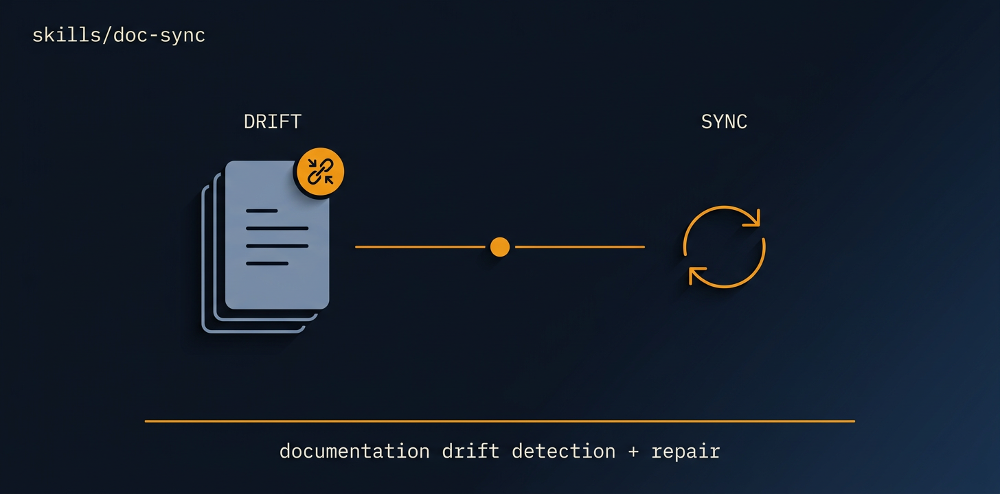

<!-- title: doc-sync | description: Bring a repo's docs back into alignment with its actual code. | sidebar_order: 5 -->

# doc-sync

<p align="center">
  
</p>

> Bring a repo's documentation back into alignment with its actual code: README, everything under
> `docs/`, `AGENTS.md` / `CLAUDE.md`, API references, setup and usage instructions, code comments
> that have drifted, and inline examples that no longer run. This is a documentation mission ONLY.
> It does not change application behaviour or logic. It makes the docs match the code as it is.

🟧 **Tier 3 · Mission**: a discrete engineering job, run via the autonomous-fleet-core engine.

**On this page:** [When to use it](#when-to-use-it) · [What it produces](#what-it-produces) ·
[What it expects from your repo](#what-it-expects-from-your-repo) ·
[Common failure modes](#common-failure-modes) · [Quick install](#quick-install) ·
[Learn more](#learn-more)

## When to use it

- Docs went stale after a refactor or a dependency change and no longer describe the code.
- Onboarding, setup, or install instructions are wrong, and new contributors hit them first.
- A README, API reference, or inline example claims something the code no longer does.
- You want a periodic documentation-truth pass, the highest-merge-success category for AI PRs.
- Trigger phrases: "sync the docs", "our README is out of date", "docs don't match the code".

## What it produces

One PR per doc area (many small PRs beat one sweeping docs PR), plus three ledger artifacts:

- `docs/doc-sync-audit.md`: the frozen DRIFT INDEX from `T-AUDIT`, every doc-vs-code
  discrepancy with its doc location and the code truth it should reflect.
- `docs/doc-sync-progress.md`: the live ledger. Per-task `WRITTEN / PR_OPEN / REVIEWED / MERGED`
  flags and the DRIFT INDEX, each item marked `OPEN` or `CLOSED via PR#n`.
- `docs/doc-sync-readiness.md`: the final report. Opens with a `fleet-outcome` YAML block
  (`drift_open`, `code_bug_findings`), then a drift summary and **Recommended next missions**.

## What it expects from your repo

- `git` and the `gh` CLI available in the target repo (the mission opens and merges PRs).
- Docs worth syncing: a `README.md`, a `docs/` tree, or `AGENTS.md` / `CLAUDE.md` to audit against.
- Example commands and snippets that can actually be run, so the reviewer can verify they work.

## Common failure modes

- A doc reveals a real code bug. doc-sync fixes the DOCS, never the code. The bug is recorded in
  `DECISIONS.md` and routed to `bug-batch`.
- An example command fails to run. The mission verifies every snippet before claiming it correct;
  a broken-deps case routes to `dependency-update`, not a doc edit.
- Two PRs touch the same doc file. Edits to one file are serialized; only non-overlapping doc
  files run in parallel.

Each mode maps to a fix in [Guide 14, Troubleshooting](../../docs/guide/14-troubleshooting.md).

## Quick install

```bash
npx skills add https://github.com/ravidsrk/autonomous-fleet \
  --skill doc-sync -y
```

Then activate it in your agent (Claude Code, Codex, Grok, or Orca) and reference it by name, or
kick it off with a phrase like `sync the docs`.

## Learn more

- [Guide 09, Mission catalog (§doc-sync)](../../docs/guide/09-mission-catalog.md): the depth here
- [SKILL.md](./SKILL.md): the agent-facing spec (process, references, validation gates)

---

← [Guide Index](../../docs/guide/README.md)
