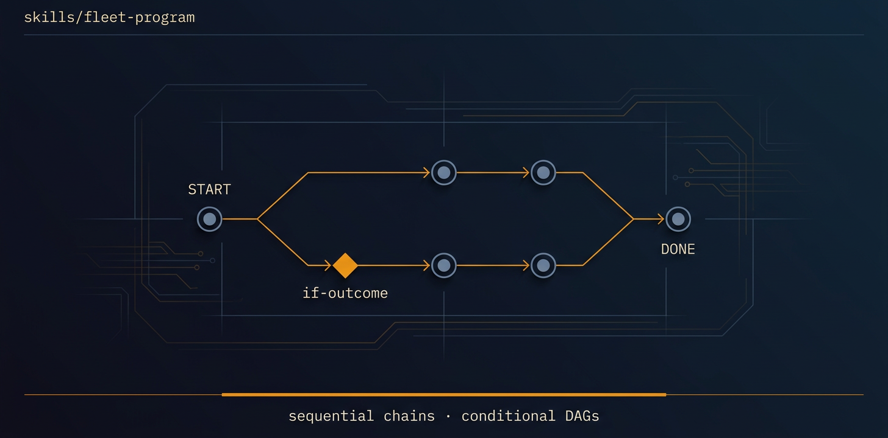

<!-- title: fleet-program | description: Chain missions into sequential programs and conditional campaign DAGs with verification gates. | sidebar_order: 4 -->

# fleet-program

**On this page:** [When to use it](#when-to-use-it) · [What it produces](#what-it-produces) ·
[What it expects from your repo](#what-it-expects-from-your-repo) ·
[Common failure modes](#common-failure-modes) · [Quick install](#quick-install) ·
[Learn more](#learn-more)

<p align="center">
  
</p>

> Orchestrate autonomous-fleet missions on one repo: sequential chains and conditional campaign
> DAGs with if-outcome edges. It reads the `fleet-outcome` YAML from each mission's readiness doc
> to branch (audit, then tests if no P0s, else dependency-update). One mission runs at a time per
> repo; cross-repo parallelism is separate sessions.

🟦 **Tier 1 · Campaigns**: the program coordinator. It composes missions with a machine-readable
gate between them so chaining does not compound errors.

## When to use it

- You want a repeatable repo-health pass: audit, then tests, then docs, in one run.
- You need a conditional chain: "if P0s are open fix them, otherwise move to coverage."
- You are shipping with proof and want a hard gate between each mission, not a vibe check.
- You want to run the same mission across several repos and aggregate at the end.
- Do NOT reach for it to run two missions on the same repo at once: that is forbidden (no shared
  lock manager).

## What it produces

- A program ledger at `docs/fleet-program-progress.md`: mode, campaign id, phase, active mission,
  current node, base branch, the pasted campaign spec, the last parsed `fleet-outcome`, a node
  status table, and the campaign runtime goal.
- A `<BRANCH_PREFIX><campaign-id>-base` branch off the default branch at HEAD; each mission's PRs
  merge into it.
- Per-node outcomes parsed from each mission's `docs/<mission>-readiness.md` `fleet-outcome` YAML.
- A FINAL report: campaign spec, per-node fleet-outcome summaries, readiness links, and the
  combined deferrals carried forward as next-mission discovery tasks.

## What it expects from your repo

- `git` and the `gh` CLI on the host (the skill's stated compatibility).
- `autonomous-fleet-core` installed, plus one runtime adapter (`-orca`, `-claude-code`, `-grok`,
  or `-codex`), and the mission skills you intend to chain, all added via `npx skills add` first.
- Each mission emits a readiness doc with valid `fleet-outcome` YAML, so the gate can branch.

## Common failure modes

- A readiness doc has no `fleet-outcome` YAML: the coordinator extracts metrics from the prose and
  logs a warning in `DECISIONS.md`. See the Troubleshooting chapter (Guide 14).
- An `if` edge uses an expression the evaluator does not recognise: the edge is skipped and logged,
  never guessed. See Guide 10 for the supported expression grammar.
- A node trips the circuit-breaker: it is marked `SKIPPED` with a `DECISIONS.md` note, then the
  campaign re-evaluates whether it can proceed.
- A mission returns `fleet-outcome.status == blocked`: the phase goes `BLOCKED`, `GOAL_BLOCKED`
  fires, and the chain stops unless that mission's rules allow a retry.
- Headless campaign mode (`run-campaign.sh`) is not yet fully validated end-to-end. The supported
  path today is interactive chat / `/goal`. See Guide 12, "Headless mode caveat."

## Quick install

```bash
npx skills add https://github.com/ravidsrk/autonomous-fleet \
  --skill fleet-program -y
```

Then activate it in your agent (Claude Code, Cursor, Grok, Codex, or Orca) and reference it by
name.

## Learn more

- [Guide 10, Campaigns](../../docs/guide/10-campaigns.md): the depth on chaining and gates
- [Guide Index](../../docs/guide/README.md): the full guide
- [SKILL.md](./SKILL.md): the agent-facing spec

---

[📖 Guide Index](../../docs/guide/README.md)
