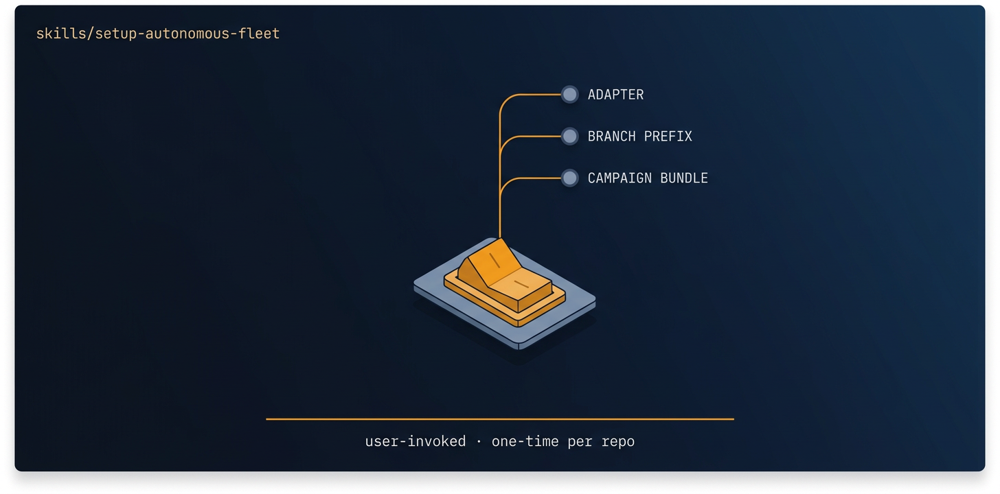

<!-- title: setup-autonomous-fleet | description: First-run, per-repo configuration for autonomous-fleet: pick an adapter, branch prefix, and default bundle. | sidebar_order: 3 -->

# setup-autonomous-fleet

<p align="center">
  
</p>

> User-invoked setup only, do not auto-activate. Configures a repo for autonomous-fleet:
> runtime adapter, branch prefix, default campaign bundle, and optional community installs.
> Run it when you say "setup autonomous fleet", "configure fleet", or on a repo's first fleet run.

🟦 **Tier 1 · Setup** — first-run configuration, run once per repo before any mission.

**On this page:** [When to use it](#when-to-use-it) · [What it produces](#what-it-produces) ·
[What it expects](#what-it-expects-from-your-repo) · [Failure modes](#common-failure-modes) ·
[Quick install](#quick-install) · [Learn more](#learn-more)

## When to use it

- You just installed the fleet skills on a repo and nothing has run yet. Do this first.
- You want coordinators and missions to share defaults instead of re-deciding the adapter every run.
- You are switching the runtime adapter (Grok Build, Claude Code, Codex, or Orca).
- You want to change the branch prefix that missions cut work onto (`<prefix><task-slug>`).
- You want to change the default `fleet-program` bundle the umbrella suggests when intent is vague.

## What it produces

This skill is prompt-driven: it explores, confirms each decision with you, then writes. A run leaves:

- `docs/agents/fleet-config.md` — the per-repo config coordinators read during SELF-ORIENTATION.
- A `## Autonomous fleet` block in `CLAUDE.md` if present, else `AGENTS.md`, updated in place, never duplicated.
- A one-line record appended to `DECISIONS.md` with the adapter, prefix, bundle, and date.

It walks you through three decisions in order: the runtime adapter (Section A), the branch prefix
(Section B, which defaults from a slugified git `user.name` or `fleet/`), and the default bundle
(Section C: `repo-health`, `ship-with-proof`, `align-then-ship`, `quality-gate`, or `none`).
Section D optionally records community-skill installs per bundle, never the full catalog, and never
without your consent.

## What it expects from your repo

- A git repository (`git rev-parse --show-toplevel` must resolve). `gh` CLI is recommended for PR workflows.
- The fleet skills installed in the active host. If they are missing, the skill prints or runs
  `./scripts/install-skills.sh` for you (all skills, or the minimal adapter set).
- Nothing else. It reads what already exists (`CLAUDE.md`, `AGENTS.md`, `DECISIONS.md`,
  `docs/agents/fleet-config.md`, `.agents/skills/`) and does not assume the defaults are correct.

## Common failure modes

- Not in a git repo: `git rev-parse` fails. Run from inside the repo root. See Guide 14, Troubleshooting.
- No host doc to edit: if neither `CLAUDE.md` nor `AGENTS.md` exists, the skill asks which to create.
- Skills not installed: the verify dry-run cannot run until `install-skills.sh` has populated the host.

## Quick install

```bash
npx skills add https://github.com/ravidsrk/autonomous-fleet \
  --skill setup-autonomous-fleet -y
```

Then activate it in your agent (Claude Code, Cursor, Grok, Codex, or Orca) and say "setup autonomous fleet".
Verify with a dry-run once setup writes its config:

```bash
./scripts/run-campaign.sh <adapter-runtime> --preset <bundle> --dry-run
```

> Headless campaign mode (`run-campaign.sh`) is not yet fully validated end-to-end. The supported
> path today is the interactive flow: chat with your agent or use `/goal`. The dry-run above is safe.

## Learn more

- [Guide 02 — Installation](../../docs/guide/02-installation.md) — the depth on setup across all runtimes.
- [SKILL.md](./SKILL.md) — the agent-facing spec that governs this skill's behavior.

← Prev · [Guide Index](../../docs/guide/README.md) · Next →
