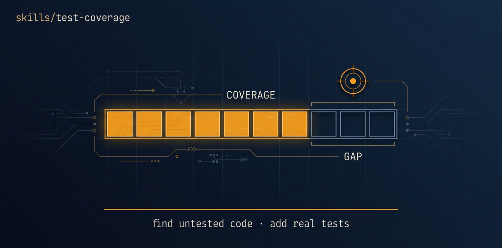

<!-- title: test-coverage | description: Raise real, behaviour-exercising test coverage on a repo or a target area, autonomously. | sidebar_order: 6 -->

# test-coverage

<p align="center">
  
</p>

> Raise real test coverage on a repo or a target area with behaviour-exercising tests, not
> coverage-padding stubs. It adds and strengthens unit, integration, and where relevant UI tests
> that genuinely assert behaviour, and it never changes your application logic. Runs fully
> autonomously via the autonomous-fleet-core engine.

🟦 **Tier 1 · Mission**: a discrete engineering job, safe to compose.

**On this page:** [When to use it](#when-to-use-it) · [What it produces](#what-it-produces) ·
[What it expects from your repo](#what-it-expects-from-your-repo) ·
[Common failure modes](#common-failure-modes) · [Quick install](#quick-install) ·
[Learn more](#learn-more)

## When to use it

- A module is undertested and you want real coverage on its core logic and edge cases.
- You are about to refactor and want to lock current behaviour with tests first.
- A feature shipped without tests and you need to backfill them.
- You want a periodic coverage pass that raises the number on real assertions, not stubs.

## What it produces

One PR per undertested area, plus three ledger artifacts written to `docs/`:

- `docs/test-coverage-map.md`: the frozen GAP INDEX, every undertested area found, by importance.
- `docs/test-coverage-progress.md`: per-task flags (`WRITTEN`, `PR_OPEN`, `REVIEWED`, `MERGED`)
  and coverage deltas per area.
- `docs/test-coverage-readiness.md`: the final report with a `fleet-outcome` YAML block
  (`gaps_open`, `coverage_regressed`) and a Recommended next missions section.

Each PR adds tests that fail if the covered behaviour breaks. A fresh build-blind reviewer rejects
any hollow test written only to move a number.

## What it expects from your repo

- `git` and the `gh` CLI available in the target repository.
- A discoverable test framework already in use (for example `pytest`, `jest`, or `go test`).
  The mission matches your existing framework and conventions, it does not introduce a new harness
  unless none exists.
- Coverage tooling is used where the repo reports it; the GAP INDEX still works without it.

## Common failure modes

- Hollow tests that pass against broken code. The reviewer rejects these. See [Guide 14:
  Troubleshooting](../../docs/guide/14-troubleshooting.md).
- Code that cannot be tested without a logic change. The mission records this as a finding for
  another mission instead of editing application logic. See [Guide 14](../../docs/guide/14-troubleshooting.md).
- No discoverable test runner. Add one, or scope the mission to an area that has tests. See
  [Guide 14](../../docs/guide/14-troubleshooting.md).

## Quick install

```bash
npx skills add https://github.com/ravidsrk/autonomous-fleet \
  --skill test-coverage -y
```

Then activate it in your agent (Claude Code, Codex, Grok, or Orca) and reference it by name.

## Learn more

- [Guide 09: Mission catalog → test-coverage](../../docs/guide/09-mission-catalog.md): the depth
  on this mission, input/output contracts, edge cases, example invocations.
- [SKILL.md](./SKILL.md): the agent-facing spec.

[Guide Index](../../docs/guide/README.md)
